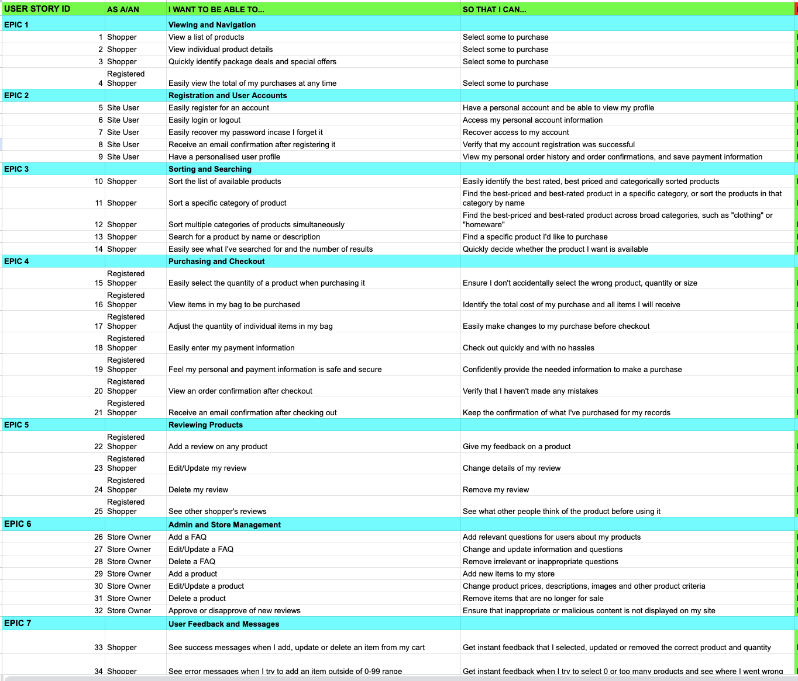
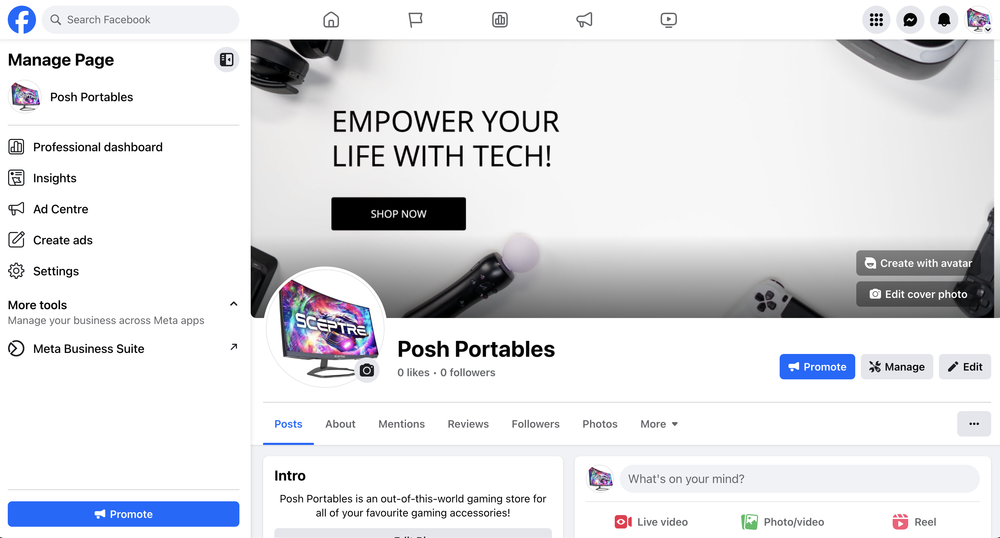
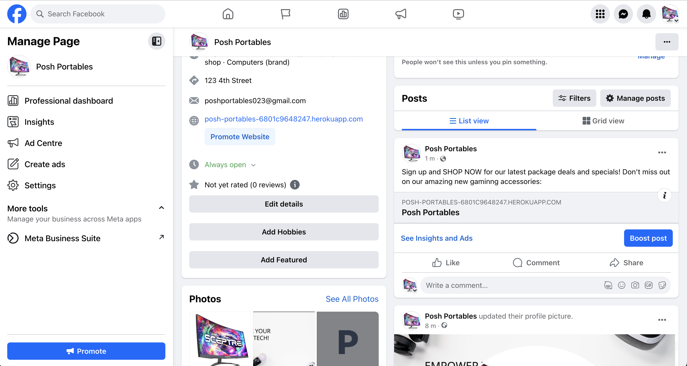
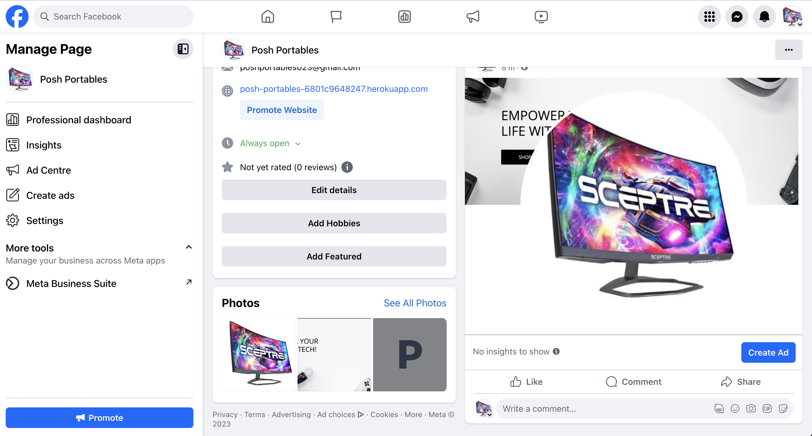
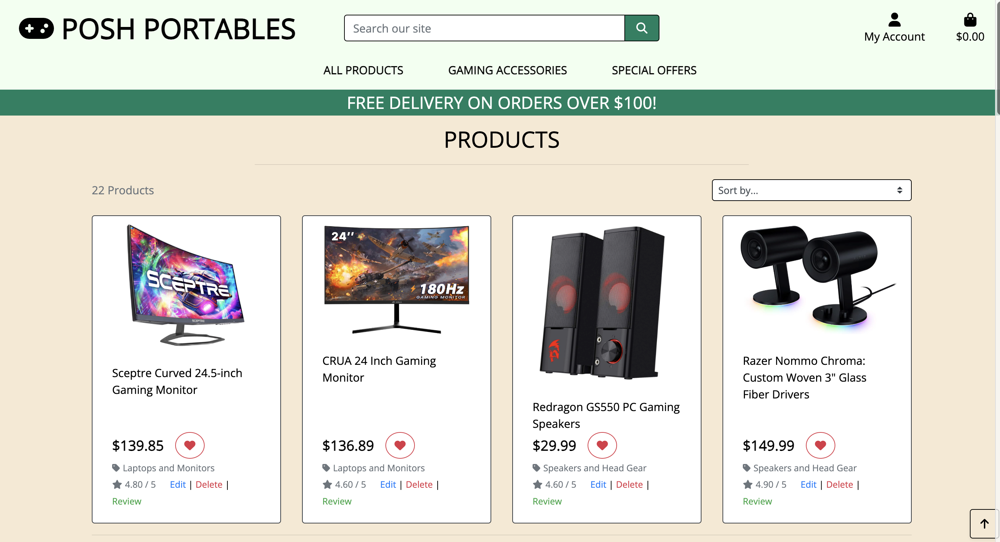

# Posh Portables - A Gaming Accessories E-Commerce Site


#### **By Lauren Pechey**
[Click here to view the live web application](https://posh-portables-6801c9648247.herokuapp.com/)

This is the documentation for my e-commerce web application: Posh Portables. It has been built using Django, Python, JavaScript, BootStrap, CSS3 & HTML5 for educational purposes as part of Code Institute’s Diploma in FullStack Software Development.

- - -
## Table of Contents

- [Planning, Design & User Experience](#planning-design--user-experience)
    - [Strategy](#strategy)
    - [Scope](#scope)
    - [Structure](#structure)
    - [Skeleton](#skeleton)
    - [Surface](#surface)
- [Features](#features)
    - [Future Features](#future-features)
- [Technologies Used](#technologies-used)
    - [Languages](#languages)
    - [Frontend Frameworks / Libraries](#frontend-frameworks--libraries)
    - [Backend Modules / Packages & Frameworks](#backend-modules--packages--frameworks)
    - [Other Tools](#other-tools)
    - [External Sites / Resources / Software](#external-sites--resources--software)
- [Testing & Bugs](#testing--bugs)
- [Deployment](#deployment)
    - [Forking the GitHub Repository](#forking-the-github-repository)
    - [Making a Local Clone](#making-a-local-clone)
    - [Deploying Your App](#deploying-your-app)
- [Credits](#credits)
    - [Code](#code)
    - [Content](#content)
    - [Acknowledgments](#acknowledgments)

- - -

## Planning, Design & User Experience

I approached the planning & design of this project using the principles of User Experience and the 5 stages of strategy, scope, structure, skeleton & surface. This is a large, complex project and I wanted to make sure it remained on course, on time and the best it could be whilst meeting all of the criteria for the MVP (Most Viable Product). 

### Strategy

#### Project Aims

The initial aims of the project were to create an e-commerce website for an imaginary company called Posh Portables, a gaming company who stock a variety of gaming accessories, such as laptops, monitors and headgear. The website's main purpose is to allow customers to browse the company's products and make purchases, tell the customers about Posh Portables and information about their online shop and allow user interactions through reviews and messages.

#### Research

I did some research into other similar websites as well as in the wider e-commerce world. I wanted to make sure that the Posh Portables' website conformed to the expectations that users have for an e-commerce site. This is extra important because it involves financial transactions and I wanted to create a feel of trustworthiness and professionalism in order to encourage users to make purchases. I also gathered design ideas for the look of this site including colour, layout and typography.

Websites visited for research:
- [Apple](https://www.apple.com/)
- [Samsung](https://www.samsung.com/africa_en/)
- [Amazon](https://www.amazon.com/PC-Accessories/b?ie=UTF8&node=318813011)
- [Best Buy](https://www.bestbuy.com/site/pc-gaming/pc-gaming-hardware/pcmcat159700050051.c?id=pcmcat159700050051)

#### User Stories

Based on my research and the project aims I created a set of user stories that would inform all the choices made in designing and developing the site. For more details information on the Tasks involved in creating these user stories, please refer to my [GitHub Project Board](https://github.com/users/pecheylauren02/projects/5).

<details><summary>User Stories</summary>

</details>

### Scope

I then created a list of all the features I would like to add to the site in order to meet all these user stories, as well as some extras that I'd like to include should time allow. I rated these in terms of difficulty and importance and this would help inform the decisions throughout the next stages of planning.

| Feature                                                                 | Difficulty | Importance |
|-------------------------------------------------------------------------|------------|------------|
| Responsive Design                                                       | 1          | 5          |
| Navigation - all page links                                             | 1          | 5          |
| Navigation - search facility                                            | 3          | 3          |
| Navigation - Shopping cart & current total                              | 3          | 4          |
| Footer - company info                                                   | 1          | 3          |
| Footer - social links                                                   | 1          | 3          |
| Home Page - branding & explanatory text                                 | 1          | 4          |
| Home Page - Featured Products                                           | 2          | 2          |
| Products - Product cards with summary info                              | 2          | 5          |
| Products - Sorting/searching/filtering                                  | 5          | 4          |
| Products - Detail Page with more info                                   | 2          | 5          |
| Products - Detail Page add to cart & quantity select                    | 4          | 5          |
| Products - CRUD functionality for admins                                | 3          | 5          |
| User Reviews of products                                                | 3          | 3          |
| User Reviews - update product average ratings                           | 5          | 3          |
| User Reviews - CRUD functionality (user only)                           | 3          | 3          |
| User Reviews - Admin approval system                                    | 4          | 2          |
| Shopping Cart - Users can store items in a cart for purchase            | 4          | 5          |
| Checkout - Page with shopping cart summary and delivery info            | 4          | 5          |
| Checkout - Secure payment system                                        | 5          | 5          |
| Checkout - Page to show order summary on successful checkout            | 3          | 3          |
| User accounts - all standard login/out/register functionality           | 4          | 5          |
| User accounts - secure & reliable                                       | 4          | 5          |
| Profile - User profile page showing order history & reviews             | 3          | 4          |
| Profile - Page to show historical order information                     | 2          | 3          |
| Profile - Users can save & update their personal info for future orders | 4          | 4          |
| Frequently Asked Questions Page - company info                          | 1          | 4          |
| FAQs - CRUD functionality for admins                                    | 3          | 2          |

---

### Structure

#### Flow Diagram

I created a flow diagram using [Lucidchart](https://www.lucidchart.com/pages/) to map out the structure of the site. This was an important step in the user experience design process, working out the structure and skeleton of the site, to provide the best user experience whilst keeping the user stories at the heart of the decision-making process. It allowed me to think through the paths of users through the site and what would need to link to where based on the different user stories. It would also allow me to make sure the site functioned as expected and everything was easy to find. It was also a vital tool to manage the scope of the project during the design and development stages, a blueprint to keep everything on track.


### Skeleton

#### Database Schema

An important stage in the planning was building a database schema, as well as planning my data clearly from the beginning to make the development process as easy as possible. This database schema was informed by my work in the previous planes, the user stories, the scope chart and the flow diagram. I used [DrawSQL](https://drawsql.app/) to create a visual representation of the database, which I used throughout the development process to keep track of what my database looked like, updating it and amending it as the project grew and adapted. 


#### Models

Below is a breakdown of all the models included in the final app. The site uses a relational database model using Postgres (SQLite & Elephant SQL). The app uses a number of models adapted from the Boutique Ado walkthrough (User, Email, UserProfile, Category, Product) as well as 3 original models (Faq, Review, Message).

<details><summary>User/Email Models (Created by Django allauth)</summary>

The User model is created by Django allauth and connects to a separate Email Address Model. I have created relationships to these models throughout the project but as I have not created them myself I have not included a breakdown of the fields. More information about Django allauth can be found [here](https://docs.allauth.org/en/latest/index.html).

</details>

<details><summary>UserProfile Model</summary>

| **Field**                   | **Field Type** | **Validation** | **null** | **blank** | **default** | **on_delete** | **editable** | **related_name** |
|-----------------------------|----------------|----------------|----------|-----------|-------------|---------------|--------------|------------------|
| **user**                    | ForeignKey     | n/a            | FALSE    | FALSE     | n/a         | CASCADE       | TRUE         | n/a              |
| **default_street_address1** | Char           | max_length=80  | TRUE     | TRUE      | n/a         | n/a           | TRUE         | n/a              |
| **default_street_address2** | Char           | max_length=80  | TRUE     | TRUE      | n/a         | n/a           | TRUE         | n/a              |
| **default_city**            | Char           | max_length=40  | TRUE     | TRUE      | n/a         | n/a           | TRUE         | n/a              |
| **default_county**          | Char           | max_length=80  | TRUE     | TRUE      | n/a         | n/a           | TRUE         | n/a              |
| **default_postcode**        | Char           | max_length=20  | TRUE     | TRUE      | n/a         | n/a           | TRUE         | n/a              |
| **default_country**         | Country        | n/a            | TRUE     | TRUE      | n/a         | n/a           | TRUE         | n/a              |
| **default_phone**           | Char           | max_length=20  | TRUE     | TRUE      | n/a         | n/a           | TRUE         | n/a              |


</details>

<details><summary>Category Model</summary>

| **Field**         | **Field Type** | **Validation** | **null** | **blank** | **default** | **on_delete** | **editable** | **related_name** |
|-------------------|----------------|----------------|----------|-----------|-------------|---------------|--------------|------------------|
| **Name**          | Char           | max_length=254 | FALSE    | FALSE     | n/a         | n/a           | TRUE         | n/a              |
| **Friendly Name** | Char           | max_length=254 | TRUE     | TRUE      | n/a         | n/a           | TRUE         | n/a              |


</details>

<details><summary>Product Model</summary>

| **Field**           | **Field Type** | **Validation**                   | **null** | **blank** | **default** | **on_delete** | **editable** | **related_name** |
|---------------------|----------------|----------------------------------|----------|-----------|-------------|---------------|--------------|------------------|
| **category**        | ForeignKey     | n/a                              | TRUE     | TRUE      | n/a         | SET_NULL      | TRUE         | n/a              |
| **name**            | Char           | max_length=50                    | FALSE    | FALSE     | n/a         | n/a           | TRUE         | n/a              |
| **description**     | Text           | n/a                              | FALSE    | FALSE     | n/a         | n/a           | TRUE         | n/a              |
| **price**           | Decimal        | "max_digits=6, decimal_places=2" | FALSE    | FALSE     | n/a         | n/a           | TRUE         | n/a              |
| **delivery_charge** | Boolean        | n/a                              | FALSE    | FALSE     | TRUE        | n/a           | TRUE         | n/a              |
| **image**           | Image          | n/a                              | TRUE     | TRUE      | n/a         | n/a           | TRUE         | n/a              |
| **rating**          | Integer        | "Min=0, Max=5"                   | FALSE    | FALSE     | n/a         | n/a           | TRUE         | n/a              |


</details>

<details><summary>Order Model</summary>

| **Field**           | **Field Type** | **Validation**                    | **null** | **blank** | **default**    | **on_delete** | **editable** | **related_name** |
|---------------------|----------------|-----------------------------------|----------|-----------|----------------|---------------|--------------|------------------|
| **order_number**    | Char           | max_length=32                     | FALSE    | FALSE     | n/a            | n/a           | FALSE        | n/a              |
| **user_profile**    | ForeignKey     | n/a                               | TRUE     | TRUE      | n/a            | SET_NULL      | TRUE         | orders           |
| **first_name**      | Char           | max_length=50                     | FALSE    | FALSE     | n/a            | n/a           | TRUE         | n/a              |
| **last_name**       | Char           | max_length=50                     | FALSE    | FALSE     | n/a            | n/a           | TRUE         | n/a              |
| **email**           | Email          | max_length=254                    | FALSE    | FALSE     | n/a            | n/a           | TRUE         | n/a              |
| **phone**           | Char           | max_length=20                     | TRUE     | TRUE      | n/a            | n/a           | TRUE         | n/a              |
| **street_address1** | Char           | max_length=80                     | FALSE    | FALSE     | n/a            | n/a           | TRUE         | n/a              |
| **street_address2** | Char           | max_length=80                     | TRUE     | TRUE      | n/a            | n/a           | TRUE         | n/a              |
| **city**            | Char           | max_length=40                     | FALSE    | FALSE     | n/a            | n/a           | TRUE         | n/a              |
| **county**          | Char           | max_length=80                     | FALSE    | FALSE     | n/a            | n/a           | TRUE         | n/a              |
| **postcode**        | Char           | max_length=20                     | FALSE    | FALSE     | n/a            | n/a           | TRUE         | n/a              |
| **country**         | Country        | n/a                               | FALSE    | FALSE     | n/a            | n/a           | TRUE         | n/a              |
| **date**            | DateTime       | n/a                               | FALSE    | FALSE     | n/a            | n/a           | TRUE         | n/a              |
| **order_total**     | Decimal        | "max_digits=10, decimal_places=2" | FALSE    | FALSE     | 0              | n/a           | TRUE         | n/a              |
| **delivery_cost**   | Decimal        | "max_digits=6, decimal_places=2"  | FALSE    | FALSE     | 0              | n/a           | TRUE         | n/a              |
| **grand_total**     | Decimal        | "max_digits=10, decimal_places=2" | FALSE    | FALSE     | 0              | n/a           | TRUE         | n/a              |
| **original_cart**   | Text |                                             | FALSE    | FALSE     | [empty string] | n/a           | TRUE         | n/a              |
| **stripe_pid**      | Char           | max_length=254                    | FALSE    | FALSE     | [empty string] | n/a           | TRUE         | n/a              |


</details>

<details><summary>OrderLineItem Model</summary>

| **Field**          | **Field Type** | **Validation**                   | **null** | **blank** | **default** | **on_delete** | **editable** | **related_name** |
|--------------------|----------------|----------------------------------|----------|-----------|-------------|---------------|--------------|------------------|
| **order**          | ForeignKey     | n/a                              | FALSE    | FALSE     | n/a         | CASCADE       | TRUE         | lineitems        |
| **product**        | ForeignKey     | n/a                              | FALSE    | FALSE     | n/a         | PROTECT       | TRUE         | lineitems        |
| **quantity**       | Integer        | n/a                              | FALSE    | FALSE     | 0           | n/a           | TRUE         | n/a              |
| **lineitem_total** | Decimal        | "max_digits=6, decimal_places=2" | FALSE    | FALSE     | n/a         | n/a           | FALSE        | n/a              |


</details>

<details><summary>Faq Model</summary>

| **Field**    | **Field Type** | **Validation** | **null** | **blank** | **default** | **on_delete** | **editable** | **related_name** |
|--------------|----------------|----------------|----------|-----------|-------------|---------------|--------------|------------------|
| **question** | Char           | max_length=100 | FALSE    | FALSE     | n/a         | n/a           | TRUE         | n/a              |
| **answer**   | Char           | n/a            | FALSE    | FALSE     | n/a         | n/a           | TRUE         | n/a              |

</details>

<details><summary>Review Model</summary>

| **Field**       | **Field Type** | **Validation** | **null** | **blank** | **default** | **on_delete** | **editable** | **related_name** |
|-----------------|----------------|----------------|----------|-----------|-------------|---------------|--------------|------------------|
| **product**     | ForeignKey     | n/a            | TRUE     | TRUE      | n/a         | CASCADE       | n/a          | reviews          |
| **user**        | ForeignKey     | n/a            | TRUE     | TRUE      | n/a         | SET_NULL      | n/a          | reviews          |
| **created_on**  | Date           | n/a            | FALSE    | FALSE     | n/a         | n/a           | n/a          | n/a              |
| **title**       | Char           | max_length=40  | FALSE    | FALSE     | n/a         | n/a           | n/a          | n/a              |
| **content**     | Text           | max_length=500 | FALSE    | FALSE     | n/a         | n/a           | n/a          | n/a              |
| **rating**      | Integer        | "Min=0, Max=5" | FALSE    | FALSE     | 0           | n/a           | n/a          | n/a              |
| **is_approved** | Boolean        | n/a            | FALSE    | FALSE     | FALSE       | n/a           | n/a          | n/a              |

</details>

#### Wireframes (see below)

Whilst traditionally wireframes are included in the Skeleton section I have included mine in the Surface section below. I have developed a way of working where I flesh out the full design of the site in [Figma](https://www.figma.com/), including making all colour, typography and layout decisions at this stage, to make sure that during development I am free to focus on the nuts and bolts of how to build the site, rather than getting distracted by design decisions at that stage. It has been successful for me in the past and so I have chosen to develop the site in this way again. 

---

### Surface

#### Wireframes

At this point I was able to bring together all the work I had done in creating the flow diagram (which included a lot of page content and structure decisions), my user stories, my scope chart and my database schema to create full visual designs for my site. This was more than just making colour and font choices however. Every design decision creates questions about what goes where, what colour should it be, does it even need to be there or would it be better somewhere else. I was able to ask informed questions at each stage to make sure the design reflected the user stories and site aims. E.g. What does a user need to see when they arrive on a page? What is the most important thing on a page and how can the design emphasise that? etc.

I created the designs below, making sure that all pages would work just as well on mobile and tablet as on desktop devices.

**View the Wireframes/Site Designs in the Dropdowns Below**

<details><summary>HOME</summary>

</details>

## Business Model and Web Marketing

### Social Media Marketing

As part of the e-commerce website requirements, I made a Facebook Business Page to advertise Posh Portables as a company. Posh Portables is not a real business, however the implementation of a Facebook Business Page aids in webmarketing of the brand which is really important for real business models. Webmarketing is an important process of marketing a business online, and using social media is often cost effective and efficient for brand exposure. 

You can find a link to my Facebook Business Page [here](https://www.facebook.com/profile.php?id=61554694944684), however incase the page is taken down at the time of your viewing, please find screenshots below. 

<details><summary>Facebook Business Page</summary>



</details>

### Email Marketing

This project also implemented an email marketing strategy through MailChimp, which is a free platform that allows websites to send emails to their customers, if their customers subscribe with their email address.

I kept the form simple with only an email address section, so users would be more likely to subscribe, and this will allow Posh Portables to send their customers promotions, special packages and more.

<details><summary>Facebook Business Page</summary>

</details>

Perhaps for future business endeavours, it would be beneficial to use other more popular social media platforms, such as Instagram, TikTok or YouTube, as well as paid advertising to ensure Posh Portables shows up in search engines. 

### Business to Customer Model

This e-commerce site is considered a B2C (Business to Customer) model, because it would typically sell gaming accessories directly to customers. Advantages include:

* Being cost effective and easy to set up
* Reaching a wide audience over time
* Direct opportunities to interact with customers

### Search Engine Optimization

More of the results of SEO can be seen in the TESTING.md document, however from a business perspective, SEO was considered an important part of promoting Posh Portables. Keywords were added to meta tags with relevant references to the business, such as "gaming accessories, Posh Portables, pc gaming monitors" etc. 

Additionally, headings were placed in <strong> tags, which increases SEO on google search engines. 

### Robots.txt and Site Maps

The robots.txt file serves as a set of instructions for web crawlers, indicating which pages or sections of a website should or shouldn't be crawled or indexed. In the context of an e-commerce site, it's essential to have a well-optimized robots.txt file to ensure search engines focus on the most relevant and important pages. This can enhance the site's visibility in search engine results and contribute to better rankings for key product pages.

On the other hand, the sitemap.xml file acts as a roadmap for search engine crawlers, providing a list of all the pages on the Posh Portables site that I wanted to be indexed. A comprehensive and up-to-date sitemap.xml file is crucial to ensure that search engines can easily discover and index all product pages, categories, and any other essential sections of the site.

## Features

This section shows details of all features on the site including details of their value to the user.

### Whole Site


<details><summary>Meta Tags</summary>

- All pages have title & description meta tags to improve their SEO performance

**Value To User**

Allows the site to be found easily by shoppers when searching online. Gives clarity to the site's purpose and content.

</details>

<details><summary>Layout</summary>

- Site width is restricted to 1400px so that the contents display correctly on wider screens as well as limiting the width of the hero image on the home page to maintain the quality. The area around the site has been set to a grey that fits with the site branding.

**Value To User**

Makes the site look good & be easy to use and navigate no matter what device a user is on. Enhances user experience and creates a positive emotional response.

</details>

<details><summary>General Responsiveness</summary>

- The site is fully responsive across all pages to help all features appear correctly and look their best on all devices. This includes:
    - Changes to font size
    - Changes to padding & margins
    - Changes to the height of divs/sections
    - Layout changes including stacking elements on smaller screens
- Details of more specific changes can be found in the feature sections below.

**Value To User**

Makes the site look good & be easy to use and navigate no matter what device a user is on. Enhances user experience and creates a positive emotional response.

</details>

<details><summary>Favicon</summary>

- The site has a Favicon using the brand's gaming icon.

**Value To User**

Builds the brand & creates brand consistency, continues the site design in the user's browser tab, makes the site feel professional the trustworthy.

</details>

<details><summary>Nav Bar</summary>

- Fully responsive nav bar
- Nav changes based on screen size, with completely bespoke layout & content for each
- Large & XL screens:
    - Clickable logo which takes the user back to the home page
    - Search box (permanently visible) which allows users to search for products. Site searches based on product name & description.
    - Account Menu - links to account based pages including authentication pages (sign in, sign out, register), profile page and site management. These links vary based on whether a user is logged in and whether they are an admin.
    - Shopping cart current contents icon - this icon's styling dynamically changes based on whether the current user has contents in their cart. It also tells the user the current total of all products in their cart.
    - Home page link
    - Products dropdown - links to the products page with a number of options to view products by category or all products.
- Medium screen & smaller:
    - Dropdown burger icon with links to:
        - Home Page
        - Products dropdown - links to the products page with a number of options to view products by category or all products.
    - Clickable logo which takes the user back to the home page (Medium Screens Only)
    - Search icon which triggers a search bar dropdown which allows users to search for products. Site searches based on product name & description.
    - Account Menu - links to account based pages including authentication pages (sign in, sign out, register), profile page and site management. These links vary based on whether a user is logged in and whether they are an admin.
    - Shopping cart current contents icon - this icon's styling dynamically changes based on whether the current user has contents in their cart. It also tells the user the current total of all products in their cart.
- Nav links have hover effects with smooth transitions. For the text-based links this is an underline which fades in. For icons it is a smooth colour transition.
- The navbar sticks to the top of the screen to aid navigation on longer pages

**Value To User**

Makes the site easy to navigate no matter where a user is on the site. Allows users to navigate on any device. Adds search and filter functionality allowing users to find the products they need very smoothly and intuitively. Provides feedback on cart contents so users can keep track of their shopping.

</details>

### Products



#### Feature Information

### Home Page


#### Feature Information

<details><summary>Hero & Intro Sections</summary>

- A visually impactful, colourful image of gaming accessores to grab the user's attention and make the site's purpose clear on first arrival
- A 'SHOP NOW' button with smooth hover effect which leads to the products page
- Text legibility to create separation and hierarchy in the design with info about the company to help expand on the site's purpose and what users can expect to find there.

**Value to User**

Makes the site's purpose and brand identity clear upon first arrival. Encourages users to head to the products section and start shopping.

</details>

<details><summary>Shop By Category</summary>

- A section with 4 buttons, 1 for each category, allowing users to navigate directly to the products page showing only products in that category.
- The buttons have friendly icons to represent each category as well as text to make them accessible.
- The buttons have a smooth hover effect where the text and background colours swap.

**Value to User**

This is useful to users as they might have a very specific product in mind e.g. a gaming monitor, and they can easily navigate to the 'Laptops and Monitors' category and find what they need. Allows purchases to be made quickly and easily with intuitive user journeys through the site and a number of different ways to navigate to the products section.

</details>

- - -

<details><summary>Products</summary>

- Products appear across the site. They have a number of fields which provide information about the product and give the site admins functionality for site management.
    - Product Image - an image to show users what they are buying. Admins can add an image of the product, or if no image is uploaded or an image fails to load a placeholder image will appear with site branding. This improves the site's design and the sense of professionalism and trustworthiness of the site which builds user confidence.
    - Product name - tells the user what they are buying
    - Product description - gives more information about the product to users - allows them to see if its right for them.
    - Product category - each product is linked to a category, this allows users to easily find the products they are looking for and helps them narrow down their search as well as encouraging users to look at other products they may not have planned on buying originally.
    - Price - Tells the user how much the product will cost them
    - Rating - Average rating of all approved reviews of the product. If no ratings them the product has a score of 0 to make it clear that it doesn't have a low rating, just that it hasn't been rated yet. The rating is represented by stars across the site, giving a quick, clear indication of what other users have thought of the product. Users are also able to order results by rating to help them find the most popular products.

**Value to User**

Products are the heart of the site functionality and purpose - the ability to buy/sell goods. The variety of fields add functionality to products, information for users and site management tools to admins.

</details>

<details><summary>Product Cards</summary>

- Products are represented in summary cards on both the products and home pages.
- Cards are clickable and link to the product details page
- Cards feature a clickable category link which takes users to the products page with the results filtered by that category.
- Cards feature a strong image or a no-image replacement (see 'products' dropdown above)
- Cards feature the product name so users can quickly understand what a product is
- Cards feature the product rating which can also be used to sort cards
- Cards feature the product price so users can know if the cost is suitable for them.
- Cards stack on smaller screens and are clear and easy to read on any device.

**Value to User**

These summary cards allow users to quickly browse products and find basic information about them. The ability to sort, search and filter products goes hand in hand with the product cards as users can see multiple products at once.

</details>

<details><summary>Products Page</summary>

- The products page is the main product browsing area. This is where a user is able to see product cards, filter them by category or search term, sort them by price, rating, name or category as well as clicking through to view more information about them.
- Aside from the featured products section on the home page all user interaction with product cards takes place on the products page. If a user clicks on a category they are taken here and see filtered results.
- Users are given information about the number of products they are viewing, which is useful to know how many options they have to look through.
- Users are told if there are any category or search terms being used to filter the results, these are clearly marked at the top which improves user experience. Whenever a filter is active a link appears to show all products, making navigation easy.

**Value to User**

A well-designed, user-friendly place for users to search, filter and compare products. The first step in the purchasing journey. Allows users to easily find what they need. Helps site owners to increase sales by showing shoppers other products that they might be encouraged to buy.

</details>

<details><summary>Product Details Page</summary>


- This is the 2nd step in a buyer's purchasing journey. Once they have selected a product from the product cards they can click through to here to find more information about the product.
- The page includes all the information about the product. It also includes a clickable category link which takes them back to the products page with products filtered by that category. This allows easy navigation, filtering and improves user experience.

- In addition to the information which the user will have already seen on the product cards they can also see additional information to help them decide whether to purchase it:
    - Product description text
    - Number of product reviews (with a clickable link to the reviews section below)
    - Product reviews
        - All reviews of the product that have been approved by an admin are visible here with their full text and rating. This allows users to get a balanced view of the product.
        - The reviews contain the review title, contents, username, date & rating.
        - If a review is a user's own they will see EDIT/DELETE buttons for it. Superusers will see DELETE buttons only.
        - For more information about reviews see [Features - Reviews](#reviews)

- The page also allows users to add the product to their shopping cart, with the option to add multiples of the product.
    - The quantity input box allows users to either type in an number (from 1-99) or use the +/- buttons to increment the quantity. These buttons are controlled by JavaScript and dynamically enable/disable when the number is at the min/max. This creates a positive user experience.
    - Once a quantity has been selected users can add the product to the shopping cart using the 'add to shopping cart' button which is styled blue for purchasing actions. [See Whole Site Features](#whole-site)

- Users can also return to the products page using the 'keep shopping' button which is styled in secondary action grey. [See Whole Site Features](#whole-site)

- Users can also add a review of a product from this page using the 'add review' button. This allows users to provide feedback on products and help share information with other users. This button is styled in the non-purchasing colour [See Whole Site Features](#whole-site)
- Admins of the site will also see 'EDIT' and 'DELETE' links which allow CRUD functionality for products. (More information below.)


**Value to User**

This is the page which helps users decide if they are going to buy the product, as well as the ability to add it to their shopping cart. This is an essential part of the purchasing journey with lots of useful information for a shopper. The reviews help users to decide if the product is for them as well as giving users the opportunity to provide feedback. This is also the the access point for EDIT/DELETE functionality for a product for admins.

</details>

<details><summary>Add Product</summary>

- The add product page is accessible via the Site Management Page [see below](#site-management). This is restricted to site admins only. Admins can use this form to add a new product to the site and set all its information.
- The form has built in validation to make sure that all required information is provided.
- The category field is pre-populated by the categories listed in the database
- The text fields (name & description) have maximum limits to avoid overly long information being added which could have a negative impact on the site design.
- The price is restricted to being numbers only and has a fixed 2 decimal place to avoid errors.

- Admins can upload an image of the product.
    - There is a button with bespoke styling to open the upload window
    - Admins can see information about best practice for photos
    - Once an image has been selected admins see a message telling them that the image has been chosen - providing clear and positive feedback.

- The form then has an 'add product' button using the site admin blue styling, or a cancel button in secondary grey. [See Whole Site Features](#whole-site).

- Once submitted users are directed to the product details page for that product so they can see their newly added product immediately appearing on the site. The only exception for this is if the product has been set to discontinued, in which case they are sent to the products page and an info message appears. However in the form there is text to explain that discontinued are accessible in the admin panel.


**Value to User**

This gives admins the ability to create a new product and set all its information in a simple to use form with bespoke site styling. It is an essential part of the site management for admins.

</details>

<details><summary>Edit Product</summary>

- The edit product page includes all of the same functionality and value as the 'add product' form (see above)
- In addition, in the image field, it includes a thumbnail of the current image (if one exists) and the ability to remove it or replace it.
- Once submitted users are directed back to the product details page for that product so they can see their changes immediately reflected on the page. The only exception for this is if the product has been set to discontinued, in which case they are sent to the products page and an info message appears. However in the form there is text to explain that discontinued are accessible in the admin panel.

**Value to User**

This gives admins the ability to create edit or update a product and set all its information in a simple to use form with bespoke site styling. It is an essential part of the site management for admins.

</details>

<details><summary>Delete Product</summary>

- Admins have the ability to remove a product from the site in one of 2 ways
    - By deleting the product
        - This is only possible if the product has never been ordered. Once it has been ordered deleting it causes errors in the order history as it is associated with an OrderLineItem object. It would change the total of historic orders which would mean the business' records were incorrect. It can also cause errors in the functionality of the site.
    - By setting the product to 'discontinued'
        - This keeps the product in the database but removes it from appearing on the site. This avoids the issues listed above.

- When an admin clicks on 'delete' they are presented with a modal which is dynamically populated based on whether a product has associated OrderLineItem objects. If it is possible to delete it (ie no associated OrderLineItem objects) then they have the option to delete, if it isn't they can mark it as discontinued.
- Admins are also able to mark an object as discontinued by using the edit product form.

**Value to User**

This gives admins the ability to control their product catalogue and which products are available for sale. It means shoppers will only see products which are currently for sale.

</details>

- - -

### shopping cart


#### Feature Information

<details><summary>Shopping Cart</summary>

- The shopping cart is an important part of purchasing process for a user. It allows them to store products as they navigate the site, then purchase them all at once when they are finished shopping.
- The items in the shopping cart can be removed or the quantities amended on the shopping cart page.
- Users can add additional items to the shopping cart. If the product is already in the shopping cart its quantity will be adjusted.
- The shopping cart is stored in the session data, that means that it is kept until the user signs out or the session cookies reset.
- Users do not have to be signed in to store items in their shopping cart or make purchases.
- The shopping cart contains information about the total cost of all the items as well as the delivery charge and grand total. It also tells the user how much more they need to spend to get free delivery.
- The shopping cart information appears in a number of places on the site
    - On the shopping cart page
    - In the nav bar shopping cart icon (includes the shopping cart total)
    - In the success message toast - which includes a shopping cart summary and link to the shopping cart page.

**Value to User**

The shopping cart is a vital tool for an e-commerce site. It allows users to gather multiple products to purchase at once, storing them in the session cookie so that they can browse the site without losing their shopping information. It provides a smooth user experience and encourages users to buy more items.

</details>


<details><summary>Summary Message</summary>

- When adding, removing or updating an item in their shopping cart users are presented with a success message which includes a shopping cart summary.
- This summary only appears when taking these actions - if the success message contains other information the summary is hidden e.g. signing in, editing a review, editing a product.
- This shopping cart summary message toast appears on any page where a user had updated their shopping cart from.
- It includes:
    - The number of items in the shopping cart
    - Image / name / quantity for each item in the shopping cart
    - The total excluding delivery
        - I made the decision to exclude delivery so that how close they were to the free delivery threshold was clear to users
    - If the total is less than the free delivery threshold users are told how much more they need to spend for free delivery.
    - A link button (button styled using 'purchasing' action blue [See Whole Site Features](#whole-site)) with a lock icon to show that the checkout is secure.
        - The content and link are set dynamically depending on what page the user is on:
            - If the user is not on the shopping cart page the button takes them to the shopping cart page
            - If the user is on the shopping cart page already the button takes them to the checkout page 
        

**Value to User**

The shopping cart summary gives users instant feedback on what is in their shopping cart every time they adjust its contents. It allows them to keep track of their purchases and totals, creating a positive user experience and clear information. By providing a link directly to the checkout users who are in a hurry can quickly complete their shopping, rather than having to navigate to the shopping cart page first.

</details>

<details><summary>Nav shopping cart</summary>

- The nav bar contains a shopping cart icon with updates dynamically based on the contents of a user's shopping cart
- The icon is a clickable link to the shopping cart page with a colour change hover effect

**Value to User**

This provides users with a constant point of information about the contents of their shopping cart. In a similar way to the shopping cart summary it provides immediate feedback about how much they are spending and whether their actions of adding products to the shopping cart have been successful. This creates a great user experience and smooth shopping journey.


</details>

<details><summary>Shopping cart Page</summary>

- The shopping cart page expands on the summary and nav icon to provide users with all the information they need about their shopping cart and purchases.
- It contains
    - A table with a summary of all items, each item is a row containing the following info:
        - Image
        - Product name
        - Price
        - Editable quantity
            - Number input to manually input values (min 1 / max 99)
            - +/- buttons to increment/decrement the value
                - These buttons are handled using JavaScript & are disabled/enabled and dynamically change styling based on the min/max value in the input
            - update link to update the shopping cart after changing the quantity
            - remove link to remove the item from the shopping cart
        - Subtotal (quantity x price)
    - shopping cart total (total without delivery)
    - Delivery cost
    - Grand total (shopping cart total + delivery)
    - If the shopping cart total is less than the free delivery threshold users see a message telling them how much more they need to spend to get free delivery
    - Checkout button (button styled using 'purchasing' action blue [See Whole Site Features](#whole-site)) with a lock icon to show that the checkout is secure.
    - Keep Shopping button to return users to products page (button styled using secondary action grey [See Whole Site Features](#whole-site))
- Delivery is calculated as follows:
    - The delivery charge is 10% of the total amount spent on items that are subject to delivery
    - If a user has spent over $100 (including on products that are not subject to delivery) then delivery is free.
- If the shopping cart is empty users see a message telling them that the shopping cart has no contents with a link back to products to encourage them to shop.


**Value to User**

The shopping cart page provides users with a comprehensive breakdown of the items they have chosen so far. From here they have controls to remove & update items in their shopping cart and can see what their total cost will be with breakdown values for delivery. They can also see if they are close to the free delivery threshold which may encourage them to buy more. It gives users a great user experience with a clear responsive layout and user friendly interface.

</details>

- - -

### Checkout


#### Feature Information

<details><summary>Checkout Page</summary>

- The checkout page is where users can check everything in their shopping cart, set their delivery information, and finalise their purchase and payment information to finally make their purchase.
- It contains:
    - A summary of the cart contents and totals, similar to the shopping cart page but without the option to adjust the contents.
    - A form to add delivery information
        - All fields are required apart from street_address2 & phone
    - If a user is logged in:
        - The form will be pre-populated with their profile information if previously provided
        - They can elect to update their profile information based on the form using a simple checkbox
        - The order will be saved in their profile and associated with their User object
    - If a user is not logged in they are directed to register/sign in if they wish to save their information
    - A secure payment form using Stripe as a simple, single input for card number, expiry and CVC.
        - The form comes built in with Stripe's comprehensive security and validation functionality
        - Site admins cannot access this information, it is sent to Stripe securely and the site is only notified if the payment has been successful or not.
        - Error messages below card input field
        - More information in "Checkout Process" below.
    - A Place Order button (button styled using 'purchasing' action blue [See Whole Site Features](#whole-site)) with a lock icon to show that the checkout is secure.
    - A Back to shopping cart button which takes users back to their shopping cart to amend the contents
    - A warning message that the user's card will be charged with the shopping cart total.
- The site uses webhooks to manage the functionality, listening for activity from Stripe to make sure that certain actions happen at the right times, that orders are created correctly in the database for a successful payment or not created if a payment fails. This ensures the site functions correctly, that users orders are fulfilled correctly and that payments work.

**Value to User**

A functioning checkout is a key part of an e-commerce site. This allows users to make purchases using secure payments, this is a vital aspect of the site for users who value security and want to protect their data. The use of webhooks and Stripe allows the site to function correctly, to make sure that orders are being stored correctly so that they can be fulfilled and tracked correctly by the company. The correct functioning of the company and the website relies on this working properly and it is of vital importance to both shoppers and site admins.

</details>


<details><summary>Checkout Process</summary>

- The checkout process is as follows:
    1. The user fills in their details and delivery information
    2. If any required fields are left blank attempted submission has front end validation that stops the form submitted and points out the field which has a problem
    3. The user fills in their card information
    4. If there is an error in the card details the user is notified in a message under the Stripe input either in realtime using JavaScript.
    5. The user clicks 'Place Order'
    6. The form is disabled and a loading animation appears
    7. If there is an error at this stage with the form or payment information the user is returned to the form to amend the error with an error message to tell them what the problem is.
    8. Once the order has gone through successfully the user is directed to the Checkout Success page (see below)
    9. The user sees a success message containing their order number and information about email confirmation
    10. The site sends the user a confirmation email to the email address provided
    11. An order is created in the database.

</details>

<details><summary>Checkout Success Page</summary>

- Once a successful purchase has been made the user is directed to the checkout success page.
- This page contains:
    - Order information:
        - Order number
        - Order date
        - Delivery Details
    - Order summary:
        - Product name
        - Quantity purchased
        - Total
        - Delivery charge
        - Grand total
    - Back to Shop button (button styled using 'purchasing' action blue [See Whole Site Features](#whole-site)) whilst this is not strictly a purchasing action it is the button colour that the user has been following to make their purchases, styling it blue subtly encourages them back to the store to continue that path to browse more products.


**Value to User**

This page gives the user a clear indication that their purchase has been successful, and summarises what they have bought and how much they have spent. It gives them a sense of security and that everything has functioned correctly, which is a vital part of the user experience for e-commerce sites. It also allows users to see what the next step is and to know that an email confirmation is on the way.

</details>

- - -

### Authentication


#### Feature Information

<details><summary>Authentication Pages (AllAuth)</summary>

- The project uses AllAuth to implement User login and authentication functionality. AllAuth comes with a whole load of backend functionality and front end templates that make the user, registration, sign in/out and user management easy and quick to create.
- AllAuth provides a series of templates for all the actions required to implement authentication. The site uses these with its own bespoke styling to make them feel part of the site.
- All the form have been styled using the [widget-tweak](https://pypi.org/project/django-widget-tweaks/) package to add styling classes to inputs, labels and error messages from within the form templates

**Value to User**

A strong authentication system is vital to an e-commerce site, allowing users to log in, register, manage their profile, see their order history and store their data for the next time they want to make a purchase. It improves user experience and make the process of visiting the site and making purchases quicker and smoother. The styling of the forms matches the rest of site making it feel like it belongs and building confidence and trust in the site.

</details>


<details><summary>Register</summary>

- The register page allows users to set up an account
- Accessible via the account menu to logged out users
- A link to 'sign-in' is provided if a user already has an account
- Form is in the standard site bespoke form styling
- Users provide an email address (repeated to check accuracy) which is used to send a verification email
- User also provide a username and password to access the site
- AllAuth provides built in verification to check the password and username to make sure they are strong and not commonly used
- Passwords are protected and site admins cannot view them (they are hashed in the admin panel).
- If a user attempts to register with an email that is already in use the form will throw an error
- (Buttons styled using standard site button colours [See Whole Site Features](#whole-site))
    - Home button - takes user back to home page without registering
    - Sign Up - submits the form
- On successful form submission users will receive a verification email in which they must click a link to verify their email in order to sign in to their account, visiting a couple of additional pages in the process (both of which have been styled with the bespoke site styling). This provides additional security and makes sure that user emails are correct.
- Once verified users can sign in using the Sign In form with their new details.

**Value to User**

Setting up an account allows users to access benefits such as storing their information & order history for future use & creating reviews. The verification and security provided by allauth makes this a secure process for users which improves their user experience and trust in the site.

</details>

<details><summary>Sign In</summary>

- Allows users to sign in to their account
- Accessible via the account menu to logged out users
- A link to 'register' is provided if a user doesn't yet have an account
- Form is in the standard site bespoke form styling
- Users can sign in using their email or username
- Users provide their account password (not visible to admins)
- There is a checkbox to tell the site to remember the user (using standard site checkbox styling).
- If an incorrect username/email & password are entered users the form fails to submit and users are shown an error message
- (Buttons styled using standard site button colours [See Whole Site Features](#whole-site))
    - Home button - takes user back to home page without registering
    - Sign Up - submits the form
- The page contains a 'forgot password' link if a user cannot log in
- On successful log in users are redirected to the home page, or, if they had previously attempted to visit a page that only logged in users could visit, they will be redirected there instead.

**Value to User**

This allows users to access their account to use their default information for purchases as well as accessing their past orders and reviews. This improves their user experience and speeds up the process of making purchases.

</details>

<details><summary>Sign Out</summary>

- Allows users to sign out of their account
- Accessible via the account menu to logged in users
- Users are taken to a page to confirm they to sign out
- Page is in the standard site bespoke styling with a button to confirm sign out
- On sign out users and their shopping cart contents are removed from the session and they are redirected to the home page


**Value to User**

The ability to sign out is an important security measure to stop other users on the same computer being able to view the user's data. This makes the site more secure and promotes trust and confidence in the site.

</details>

<details><summary>Manage Email</summary>

- The manage email page is accessible via the user profile page
- Only logged in users can access this page & users can only view their own emails
- Page is in the standard site bespoke styling with a button to add an email address
- There are 3 additional buttons for managing email actions which are styled using the site colours but are smaller to signify that they are less important actions.
- From here users can view their associated email addresses, change their primary email, re-send verification for emails and remove email addresses. They can also add additional email addresses.
- Adding a new email sends a verification to that address.
- There is a button to take users back to their profile page using the secondary grey styling.

**Value to User**

This page allows users to add or change their email as well as defining which email is used as their primary form of contact. This is a useful bonus tool for users to manage their account and improve their user experience.

</details>

<details><summary>Change Password</summary>

- The change password is accessible via the user profile page
- Only logged in users can access this page & users can change their own password
- Page is in the standard site bespoke styling with a button to submit form
- There is a button to take users back to their profile page using the secondary grey styling.
- Users must submit their current password and their new password twice to check for accuracy
- The new password is checked for common or insecure passwords, the form will not submit if these are used and the users are shown an error message.
- This page is only for users who know their current password and wish to change it. The forgot password page is available for users who have forgotten their password and cannot sign in. (See below).

**Value to User**

This page allows users to change their current password if they are concerned about security and password management. This improves their trust in the site, the site's security and their user experience.


</details>

<details><summary>Forgot Password</summary>

- The forgot password page is accessible via the sign in page for users who attempt to sign in but cannot remember their password.
- The user is prompted to enter their email address
- If a user enters an email address that is not in the database they will be notified in an error message
- If the user enters a correct email they will be sent an email with a link to the password reset page
- Once on the password reset page the user is able to reset their password and sign in to the site with the new password but submitting another form.
- All pages are in the standard site bespoke styling with a button to submit forms, a grey home button to return to the home page and colours and fonts that reflect the rest of the site. 

**Value to User**

The ability to reset a password is very important to users who have forgotten their password, it allows them to gain access to their account data including their order history and reviews which would otherwise be inaccessible to them. It is a vital part of site authentication.

</details>

- - -

### Error Pages


#### Feature Information

<details><summary>Error Pages</summary>

- The site has bespoke error pages for the main errors that the site might throw up (400)
- They feature a link to the home page so users can navigate back to a page that exists and works without using the nav or browser back button.

**Value to User**

This creates a positive user experience when taking an action that results in an error. It means they don't feel like they have left the site entirely and are quickly able to get back home again.

</details>

- - -

### Future Features

There are a number of features I would like to implement in the future, particularly if I were adapting this in to a real live site for an online shop as there is some functionality I feel it would really benefit from.

#### Admin Messaging System
I would like to build a messaging system, giving the site admins the ability to reply directly from the site, to be able to view the historic chain of communication, to have multiple statuses for messages e.g. in-process, and to connect messaging to the user so that users could also reply from within the site rather than via email. I would also like to add notifications to both admins and users when they receive a message, with an icon appearing in the navbar to alert them.

#### Order Tracking
I feel that an e-commerce site would also benefit from an order-tracking system which notifies admins when an order is placed and then can be tracked from within the site management area, with its status changing depending on what stage the order is at e.g. 'out for delivery' 'cancelled' etc.

#### Stock Control
I also think some sort of stock control would be useful for an e-commerce site, with products having stock supply levels and logic to hide items that are out of stock as well as notify admins when things need to be re-supplied. This would also need to be integrated with any physical shop that the owners might have and so would be a significant project.

- - -
[Go to Top](#posh-portables---a-gaming-accessories-e-commerce-site)
- - -

## Technologies Used

### Languages

- [HTML:](https://en.wikipedia.org/wiki/HTML5) Used to build the main structure of the site
- [CSS:](https://en.wikipedia.org/wiki/Cascading_Style_Sheets) Used to style the website (Combination of bespoke styling and Bootstrap)
- [JavaScript:](https://en.wikipedia.org/wiki/JavaScript) Used for front end interactive features
  - shopping cart / Product Quantity Input
  - Stripe Payment Handling
  - Message is_open toggle functionality
  - Review is_authorised toggle functionality
  - Manage page scroll on refresh
  - Product form image field text
  - Product sorting page reload
  - Countryfield on address forms
  - Review rating select interactive styling
  - Scroll to Top button
  - Remove & Update products from shopping cart
- [Python: ](<https://en.wikipedia.org/wiki/Python_(programming_language)>) Used to build the core of the backend of the project within the Django framework


### Frontend Frameworks / Libraries

- [Bootstrap:](https://getbootstrap.com/) Used throughout the site for the styling, layout & responsiveness
- [Font Awesome:](https://fontawesome.com/) Used to add icons to the site to help with UX and to add more character
- [JQuery:](https://jquery.com/) JavaScript library for making JavaScript quicker and easier to write


### Backend Modules / Packages & Frameworks

- [Django:](https://www.djangoproject.com/) High Level Python-based Web Framework.
- [AllAuth:](https://django-allauth.readthedocs.io/en/latest/) Integrated Django authentication & sign in.
- [Django Countries:](https://pypi.org/project/django-countries/) Django application that provides country choices for forms
- [Django Widget Tweaks:](https://pypi.org/project/django-widget-tweaks/) Django form field advanced styling & customisation
- [Django Storages:](https://django-storages.readthedocs.io/en/latest/) Collection of custom storage backends for Django
- [Freezegun:](https://pypi.org/project/freezegun/) Library to aid automated testing by giving control over the datetime module
- [Gunicorn:](https://gunicorn.org/) A Python WSGI HTTP Server for UNIX
- [Pillow:](https://pypi.org/project/Pillow/) Python imaging Library for extended image handling capabilities
- [Psycopg2:](https://www.psycopg.org/) Postgres adaptor to allow smooth communication between the backend and the database
- [s3transfer:](https://pypi.org/project/s3transfer/) Python library for managing Amazon AWS S3 Transfers
- [Boto3](https://boto3.amazonaws.com/v1/documentation/api/latest/index.html) & [Botocore:](https://github.com/boto/botocore) Used to create, configure & manage AWS services using Python
- [Stripe:](https://stripe.com/gb) Stripe package part of the Stripe ecosystem to manage secure online payments
- [dj-database-url:](https://pypi.org/project/dj-database-url/) Allows you to use DATABASE_URL env variable in settings.py
- [Coverage:](https://coverage.readthedocs.io/en/7.3.1/) Tool for measuring code coverage of Python Programs
- [oauthlib](https://pypi.org/project/oauthlib/) & [requests-oauthlib:](https://pypi.org/project/requests-oauthlib/) Handles authentication using the OAuth request signin logic
- [python3-openid:](https://pypi.org/project/python3-openid/) Set of python packages to support the use of teh OpenID decentralised identity system
- [sqlparse:](https://pypi.org/project/sqlparse/) SQL parser for Python
- [urllib3:](https://pypi.org/project/urllib3/) HTTP client for Python


### Databases 
- [SQLITE:](https://docs.djangoproject.com/en/4.1/ref/databases/#sqlite-notes) Used as the built in Django database for development
- [Elephant SQL:](https://www.elephantsql.com/) Postgres-based database host. Used to host the database for the live production app.

### Other Tools

- [Git:](https://git-scm.com/) Used for version control via Code Anywhere by using the terminal to Git and Push to GitHub
- [GitHub:](https://github.com/) Used to store the project code
- [Gitpod:](https://www.gitpod.io/) Used to create, edit & preview the project's code
- [Heroku:](https://dashboard.heroku.com/apps) Used to deploy the live site
- [Amazon Web Services:](https://aws.amazon.com/) Used to host the static files and images for the live production site.
- [Google Chrome Dev Tools:](https://www.google.com/intl/en_uk/chrome/) Used to test and debug the production and live apps


### External Sites / Resources / Software

- [Figma:](https://www.figma.com/) Used to develop the wireframes in to a full site design including colours, fonts, proportions etc
- [Google Fonts:](https://fonts.google.com/) Used to select & import the fonts to the project (Oxygen & Source Sans 3)
- [Lucidchart](https://www.lucidchart.com/pages/) To create the flow diagram of the website
- [DrawSQL](https://drawsql.app/) Used to visually design the database schema
- [ChatGPT:](https://chat.openai.com/auth/login) Used to generate copy to populate site (not used for any code)
- [Adobe Illustrator:](https://www.adobe.com/uk/products/illustrator.html) Used to create the site logo
- [Adobe Photoshop:](https://www.adobe.com/uk/products/photoshop.html) Used to crop, adjust and resize the photos to optimise them for the site
- [Bulk Photo Resize:](https://bulkresizephotos.com/en) Used to resize & convert images 
- [Tiny PNG:](https://tinypng.com/) Used to further optimise the images for the site and reduce file size
- [ezGIF:](https://ezgif.com/) Creating GIFs for the README
- [tableconvert.com:](https://tableconvert.com/csv-to-markdown) Converting CSV files to Markdown tables for README
- [Favicon.io:](https://favicon.io/favicon-converter/) Used to create and add the favicon to the browser tab
- [Google Chrome Dev Tools:](https://developers.google.com/web/tools/chrome-devtools) Used to inspect page elements, debug issues with the site & test responsiveness on different mockup devices
- [Techsini:](http://techsini.com/multi-mockup/index.php) Website mockup image generator for images in this README.
- [Temp Mail:](https://temp-mail.org/en/) Temporary email generator for testing account verification & order confirmation

- - -
[Go to Top](#posh-portables---a-gaming-accessories-e-commerce-site)
- - -

### Testing & Bugs

The site has been thoroughly tested using both automated and manual testing as well as validation for code, performance & accessibility full test results and details of bugs and their fixes can be found in the [TESTING document](TESTING.md)

- - -
[Go to Top](#posh-portables---a-gaming-accessories-e-commerce-site)
- - -

## Deployment

### Forking the GitHub Repository

Forking the GitHub repository allows you to create a duplicate repository in order to make changes without affecting the original.

1. Log in to GitHub and go to the [Posh Portables GitHub repository](https://github.com/pecheylauren02/mp5_posh_portables)
2. Click on Fork (top right) to fork the repository
3. Give the fork a name and description if you wish and click "Create Fork"
4. You can now open the repository in your IDE of choice e.g. GitPod
5. Once in your IDE you can install the project requirements from the requirements.txt file using the command `pip3 install -r requirements.txt`

---

### Making a Local Clone

A local clone allows you to create a copy of the project to work on locally on your own computer in your code editor of choice (e.g. VS Code)

1. Log in to GitHub and go to the [Posh Portables GitHub repository](https://github.com/pecheylauren02/mp5_posh_portables)
2. Click on "Code"
3. To clone using HTTPS copy the provided link on the HTTPS tab
4. Open your own terminal for your coding environment (making sure you have Git installed)
5. Set your current directory to the location you want to store your new clone
6. Type `git clone`, followed by the copied link you copied from GitHub e.g. `git clone https://github.com/pecheylauren02/mp5_posh_portables.git`
7. Press Enter to create your local clone of the project
8. Set up your local development environment
9. Install the project requirements from the requirements.txt file in the project using the command `pip3 install -r requirements.txt`
10. Create your own env.py file containing all the required environment variables
11. You are now ready to start working on your own clone of the project - enjoy!


For more details and information go to GitHub's useful guide to [cloning repositories](https://docs.github.com/en/repositories/creating-and-managing-repositories/cloning-a-repository#cloning-a-repository-to-github-desktop)

---

### Deploying Your App

Deployment allows you to transfer your project from your local environment or IDE to hosting it publicly for other people to view and enjoy. There are certain steps you will need to take to do this and they are detailed below. **These instructions are based on using an IDE like GitPod and having followed the instructions for Forking the repository above, especially installing the requirements.** For users wishing to deploy from a local clone different steps may be required which will depend on your local development environment.

#### Setting up a Database

When working on the app in GitPod a local database (sqlite) is used which will not be available on the deployed app. You will need to set up a separate database for the deployed site.

1. Go to [ElephantSQL](https://www.elephantsql.com/) and click on 'get a managed database'
2. Select 'Tiny Turtle'
3. Sign in using your GitHub account & authorise ElephantSQL to access your GitHub account
4. Set up a team and go through the login credential process or log in if you already have an account
5. Once you are logged in name your plan (usually the project name)
6. Select your nearest region
7. If you're happy click on 'create instance'
8. Go to your dashboard (click on the ElephantSQL logo) and click on the instance name
9. Copy the database URL... you will need this for the next steps

---

#### Set up Heroku & connecting your new Database


1. Go to [Heroku](https://www.heroku.com/) and log in (or set up an account if you don't have one - please note you may incur charges for using Heroku)
2. Click on the 'New' button then 'create new app'
3. Name your app and select your nearest region
4. With your app set up go to the app's settings tab and under config variable click on 'reveal config variables' and add a new variable with the Key of `DATABASE_URL` and the value as the database URL that you copied from ElephantSQL
5. Back in GitPod go to settings.py and paste the following in to your DATABASE section to tell it to connect to the new database **Note - do not push your code to GitHub whilst this value is in your settings.py, it is a secret value that must not be shared, we will remove it later**

```
DATABASES = {
        'default': dj_database_url.parse(os.environ.get('your elephanySQL database url here'))
    }
```

6. In you GitPod terminal type `python3 manage.py showmigrations` to check you are connected to the new database, if you are you will see a list of migrations with no ticks next to them
7. Run the following command `python3 manage.py migrate` to migrate the database structure from your project to the new database
8. Any data that you have added to your SQLite database will not transfer to the new one. You will need to populate the site on the deployed app once it is up and running or using Fixtures (JSON files with all your database content) if you have them. You can find out more about Fixtures and how to use them in the [Django documentation.](https://docs.djangoproject.com/en/4.2/howto/initial-data/#:~:text=you%20use%20TransactionTestCase.-,fixtures%20.,the%20manage.py%20dumpdata%20command.)
9. Create a superuser for your deployed site and new database (this will allow you to check if the database is working and access the site admin on the deployed site) using the following command in the terminal: `python3 manage.py createsuperuser` and set up login details for them following the instructions.
10. Go to the ElephanySQL site, click on your database, go to the browser tab and click on 'table queries' and select 'auth_user (public)' and click on execute, you should see your newly created user.
11. You now need to remove your new database settings from settings.py and set it up to know which version of the site you are on (development or live) to know which database to use. Go back to your GitPod dashboard, click on your avatar to go your your GitPod user settings and select 'variables'
12. Add a key of DEVELOPMENT and a value of True
13. Got to your settings.py file to the DATABASES section and replace what's there with the following code (this checks to see if there is a value called DEVELOPMENT in your environment variables - ie your development environment, rather than the deployed app and sets the database accordingly.)

```
if 'DATABASE_URL' in os.environ:
    DATABASES = {
        'default': dj_database_url.parse(os.environ.get('DATABASE_URL'))
    }
else:
    DATABASES = {
        'default': {
            'ENGINE': 'django.db.backends.sqlite3',
            'NAME': os.path.join(BASE_DIR, 'db.sqlite3'),
        }
    }
```

14. Now that you have removed your ElephantSQL database url from the settings.py file it is safe to push your code to GitHub again. Your deployed database is set up and GitPod knows which one to use for which version of the site.


#### Deploying to Heroku

1. Create a Procfile in your app in the root directory with the following content `web: gunicorn posh_portables.wsgi:application` and a blank line at the end.
2. Log in to Heroku using the GitPod terminal using the command `Heroku login`` and enter your Heroku email and password
  - if you have 2 factor authentication set up you will need to use `Heroku login -i` followed by your email and your Heroku API key as the password which you can find in your account settings on Heroku
4. Temporarily disable Heroku from collecting static files during deployment using the command `heroku config:set DISABLE_COLLECTSTATIC=1 --app heroku-app-name`
5. Commit your changes to GitHub using `git add .`, `git commit` & `git push` in the terminal
6. Then to deploy your site to Heroku use the command `git push Heroku main`
7. Your site will now be deployed without any of the static files (CSS, JavaScript & Media files)
8. In Heroku go to your app, click on activity to check if it has finished deploying and once it has go to the settings tab
9. Scroll down to 'Domains' and copy the 'your app can be found at' URL
10. Back in GitPod go to settings.py and add your deployed site's URL to the ALLOWED_HOSTS list
11. `git add .`, `git commit` & `git push` again and then `git push Heroku main` to push your changes
12. Once the site has finished deploying you should be able to navigate to the deployed site's URL and see your site content, though it will be a little strange-looking without CSS & media files!
13. You now need to replace the Django secret key in your settings.py (if you included it there) with an environment variable to keep it safe. To do this you can use a Django secret key generator online e.g. [djecrety](https://djecrety.ir/), copy the key it provides.
14. Go to your Heroku app's dashboard, open settings and reveal config variables and add a new variable with a key of SECRET_KEY and a value of what you just copied.
15. In GitPod, if you have used your secret key in settings.py, go back to your GitPod dashboard, click on your avatar to go your your GitPod user settings and select 'variables'
16. Add a key of SECRET_KEY and a value of a different Django secret key from your online key generator (djecrety or similar)
17. In settings.py and change the SECRET_KEY to `SECRET_KEY = os.environ.get('SECRET_KEY', '')`
18. Below it change the value of DEBUG to the following `DEBUG = 'DEVELOPMENT' in os.environ` to dynamically change whether the app is in DEBUG mode depending on whether it is the development or deployed site
19. `git add .`, `git commit` & `git push` again and then `git push Heroku main` to push your changes
20. You can also tell Heroku to automatically deploy so you don't need to push changes to both GitHub and Heroku each time - you'll find this under the Deploy tab on your Heroku app.


#### Setting Up Your Static Files on Your Deployed Site using Amazon Web Services (AWS)

There are many options for storing your static files for a deployed site, below are the instructions for using Amazon Web Services as a cloud storage provider.

1. Create an AWS account [here](https://aws.amazon.com/) (Select a personal account for the account type). You will need to fill in your information and card details to set up an account
2. Once your account is set up and you're signed in search for s3 in the search bar
3. Click on 'create bucket' and name it to match your Heroku app, selecting your closest region and uncheck 'block all public access' then click on create bucket to set it up
4. Click on your new bucket name and go to the properties tab
5. Scroll to the bottom and click on the edit button by 'Static Website Hosting' and select 'enable', giving default values for the index and error documents (index.html & error.html) then click save changes.
6. Go to the permissions tab and copy the ARN value at the top.
7. Scroll down to the bucket policy section, select 'edit' and 'policy generator'
8. Select 'S3 bucket policy' from the dropdown
9. In principles put a * to allow all
10. Set the action to 'Get Object'
11. Paste the earlier ARN value in the ARN input
12. Click on 'add statement' then 'generate policy'
13. Copy the policy text that the generator creates
14. Back in your bucket settings (should still be open in another tab) paste the text in to the Bucket Policy empty text area then add a '/*' to the end of the resource value (which should have your bucket name in it) this will allow access to all the resources in the bucket and click save
15. Scroll down to the access control list and grant Read and Write access to Everyone (public access) by checking the boxes
16. Scroll down to the Cross-Origin Resource Sharing (CORS) section and paste in the following and save:

```
[
    {
        "AllowedHeaders": [
            "Authorization"
        ],
        "AllowedMethods": [
            "GET"
        ],
        "AllowedOrigins": [
            "*"
        ],
        "ExposeHeaders": []
    }
]
```

17. Go back to your AWS dashboard by clicking on the AWS logo at the top left and type in IAM in the search bar and select the IAM service
18. Click on the user groups tab and create a new group, with the name of your choice, ideally with your app name in it and create the group
19. Go to the policies tab and create a policy, go the JSON tab and search for the S3FullAccess policy and import it
20. Edit the policy to the following:

```
{
    "Version": "2012-10-17",
    "Statement": [
        {
            "Effect": "Allow",
            "Action": "s3:*",
            "Resource": [
                "arn:aws:s3:::bucket-name",
                "arn:aws:s3:::bucket-name/*",
            ]
        }
    ]
}
```

21. Click on next and then review
22. Name the policy and give it a description and then create your policy
23. Go to the User Groups tab, select your group and go to permissions and click 'add permissions' then 'attach policy' selecting your newly created policy and clicking 'Attach policies'
24. Create a user for the group by going to the User tab and clicking 'create user'
25. Name your user (you don't need to select AWS Console access) click next and add your user to your group clicking next as required and 'create user'
26. Download and save the csv file with the user's credentials - this is important, you will not be able to access this information again
27. Back in GitPod go to your settings.py file and paste in the following code which tells the app to look for an environment variable called USE_AWS and if it's there to use the following settings to access the static files.

```
if 'USE_AWS' in os.environ:
    # Cache control
    AWS_S3_OBJECT_PARAMETERS = {
        'Expires': 'Thu, 31 Dec 2099 20:00:00 GMT',
        'CacheControl': 'max-age=94608000',
    }

    # Bucket Config
    AWS_STORAGE_BUCKET_NAME = 'posh-portables'
    AWS_S3_REGION_NAME = 'eu-west-2'
    AWS_ACCESS_KEY_ID = os.environ.get('AWS_ACCESS_KEY_ID')
    AWS_SECRET_ACCESS_KEY = os.environ.get('AWS_SECRET_ACCESS_KEY')
    AWS_S3_CUSTOM_DOMAIN = f'{AWS_STORAGE_BUCKET_NAME}.s3.amazonaws.com'
```
28. Set up the following config variables in Heroku using the information in the csv file that you downloaded:
  - AWS_ACCESS_KEY_ID: *your access key value*
  - AWS_SECRET_ACCESS_KEY: *your secret access key value*
  - USE_AWS: True
29. Remove COLLECTSTATIC from the config variables in Heroku
30. Back in GitPod create a file called custom_storages.py in the root directory and add the following:

```
from django.conf import settings
from storages.backends.s3boto3 import S3Boto3Storage


class StaticStorage(S3Boto3Storage):
    location = settings.STATICFILES_LOCATION


class MediaStorage(S3Boto3Storage):
    location = settings.MEDIAFILES_LOCATION

```

31. In settings.py add the following to tell it to look for the new storage classes we just created in custom_storages and to override the URLS for static and media files. Put this just below the AWS code from earlier within the if `'USE_AWS' in os.environ` statement.

```
# Static and media files
STATICFILES_STORAGE = 'custom_storages.StaticStorage'
STATICFILES_LOCATION = 'static'
DEFAULT_FILE_STORAGE = 'custom_storages.MediaStorage'
MEDIAFILES_LOCATION = 'media'

# Override static and media URLs in production
STATIC_URL = f'https://{AWS_S3_CUSTOM_DOMAIN}/{STATICFILES_LOCATION}/'
MEDIA_URL = f'https://{AWS_S3_CUSTOM_DOMAIN}/{MEDIAFILES_LOCATION}/'

```

32. You're nearly there! Save your settings.py then push to add/commit/push to GitHub (if you've set up automatic deploys you won't need to also push to Heroku)
33. Once the deployment has finished check your S3 bucket, there should be a static folder in there with your static files (CSS / JS folders with files inside) and the live site should now have its CSS styling and any JavaScript functionality.
34. Finally to add your media files (images & video) simply go back to AWS, create a new folder called 'media' in the same place as the new 'static' folder, click on the folder and drag and drop all your media files in to the browser window.
35. Click next and under manage public permissions select 'grant public access to these objects' and click upload
35. Your site should now contain all your images, videos, styling and JavaScript! Well done!


#### Setting up Stripe Payments on your deployed site

1. Log in to Stripe, click on the developers tab and API keys copy the API key and set them in Heroku as config variables in the following:

- STRIPE_PUBLIC_KEY: Stripe publishable key goes here
- STRIPE_SECRET_KEY: Stripe secret key goes here

2. Back in Stripe set up a new webhook for your deployed site by clicking on webhooks, click on 'add endpoint' and paste in your deployed site's URL setting it to listen for all events.
3. Click on your newly set up webhook and click on 'Signing Secret' at the top to reveal the secret value. Copy it and set it as a new config variable in Heroku:
- STRIPE_WH_SECRET: Signing secret from new webhook.

- - -
[Go to Top](#posh-portables---a-gaming-accessories-e-commerce-site)
- - -

## Credits

### Code

I have found many useful sources in building this project, as this has been my first Django project I have often been reliant on a lot of Googling and trawling through documentation and Slack channels. Any code that requires crediting has been mentioned within the code itself. However below are some projects which I have found useful for more general inspiration and to help me answer the more general questions about how to approach different aspects of the project:
- [Code Institute](https://codeinstitute.net/) team for their [Boutique Ado](https://github.com/Code-Institute-Solutions/boutique_ado_v1/tree/250e2c2b8e43cccb56b4721cd8a8bd4de6686546) project as this had a big influence on my own Posh Portables site. Parts of the code are heavily inspired by and adapted from Boutique Ado. Using Django and building an e-commerce site was a huge challenge and I was grateful to have this walkthrough to follow whilst I built my confidence on my own project, using it as a starting point to expand upon to create Posh Portables.
- [StackOverflow](https://stackoverflow.com/) for general coding questions. 
- [MdBootstrap](https://mdbootstrap.com/) for designs and code snippets. 

- - -

### Content

#### Text

- [ChatGPT:](https://chat.openai.com/auth/login) Used to generate text for the products, reviews, messages & FAQs to quickly populate the site so my time could be better spent on building the site and my coding knowledge. **It was not used to generate any code for the project.**

#### Images

##### Home Cover and 404 page:
- [Home Cover and 404 Page image](https://www.pexels.com/photo/white-and-black-xbox-one-controller-3945655/)

##### Amazon Product Images:

##### Laptops and Monitors
- [10001](https://m.media-amazon.com/images/I/71OyrTkxpGL._AC_SL1500_.jpg)
- [10002](https://m.media-amazon.com/images/I/711+0tgn+6L._AC_SY300_SX300_.jpg)
- [10003](https://m.media-amazon.com/images/I/81vnNsRDo6L._AC_SL1500_.jpg)
- [10004](https://m.media-amazon.com/images/I/71eXjkfeO8L._AC_SL1500_.jpg)
- [10005](https://m.media-amazon.com/images/I/91KW9iWwXxL._AC_SL1500_.jpg)
- [10006](https://m.media-amazon.com/images/I/71P1MZ8ztDL._AC_SL1500_.jpg)
- [10007](https://m.media-amazon.com/images/I/71hdoqCHwiL._AC_SL1500_.jpg)

##### Speakers and Headgear
- [20001](https://m.media-amazon.com/images/I/71UuyaUmkhL._AC_SL1500_.jpg)
- [20002](https://m.media-amazon.com/images/I/71w-eYgrfnL._AC_SL1500_.jpg)
- [20003](https://m.media-amazon.com/images/I/51wEJVJjuLL._AC_SL1000_.jpg)
- [20004](https://m.media-amazon.com/images/I/71uGQWi6DzL._AC_SL1500_.jpg)
- [20005](https://m.media-amazon.com/images/I/61CGHv6kmWL._AC_SL1000_.jpg)
- [20006](https://m.media-amazon.com/images/I/71EMsWRD1oL._AC_SL1500_.jpg)

##### Keyboards
- [30001](https://m.media-amazon.com/images/I/81yd9W+0doL._AC_SL1500_.jpg)
- [30002](https://m.media-amazon.com/images/I/618zZ7u3sUL._AC_SL1500_.jpg)
- [30003](https://m.media-amazon.com/images/I/61nghmq8GPL._AC_SL1500_.jpg)
- [30004](https://m.media-amazon.com/images/I/71HQVSBbTLL._AC_SL1500_.jpg)
- [30005](https://m.media-amazon.com/images/I/61ZaLWoqtcL._AC_SL1280_.jpg)

##### Package Deals and Specials
- [40001](https://m.media-amazon.com/images/I/71S-pQNQyIL._AC_SL1500_.jpg)
- [40002](https://m.media-amazon.com/images/I/71lXzd0i9AL._AC_SL1500_.jpg)
- [40003](https://m.media-amazon.com/images/I/718sn7oOcfL._AC_SL1500_.jpg)
- [40004](https://m.media-amazon.com/images/I/71PQ-veSExL._AC_SL1500_.jpg)
- [40005](https://m.media-amazon.com/images/I/71r5g4eWy7L._AC_SL1500_.jpg)

- - -

### Acknowledgments

* My mentor Rohit Sharma for all his help and advice throughout the project.
* The whole team at [Code Institute](https://codeinstitute.net/) for their teaching and support.

- - -
[Go to Top](#posh-portables---a-gaming-accessories-e-commerce-site)
- - -
