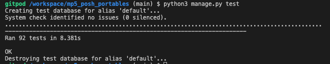
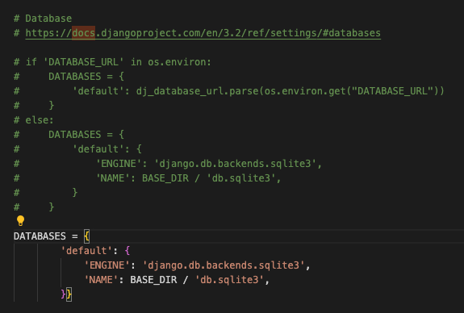
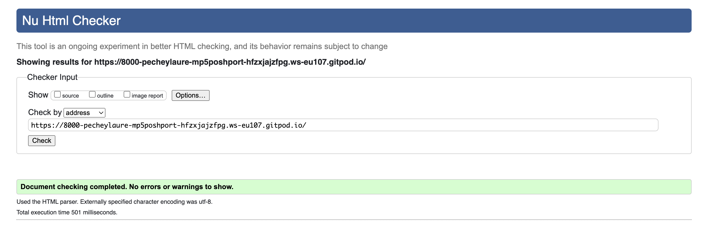
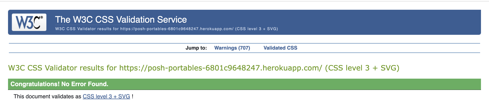
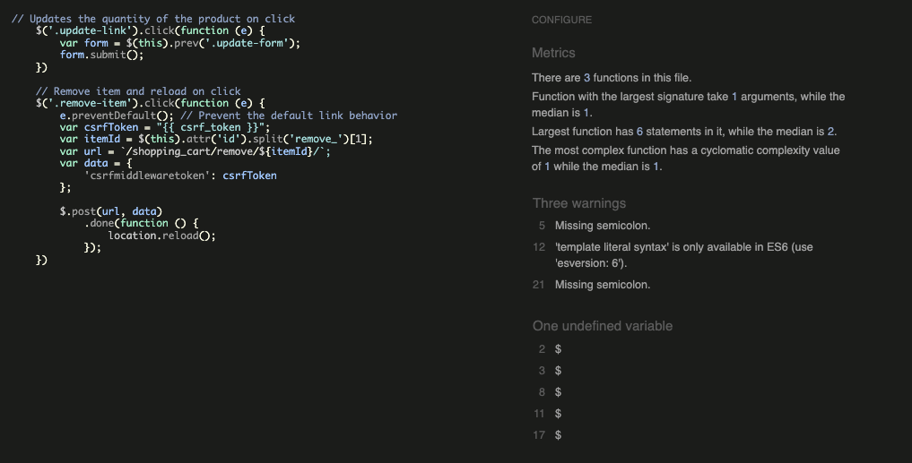
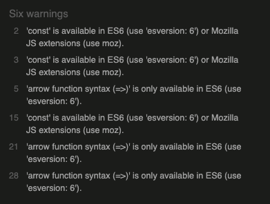
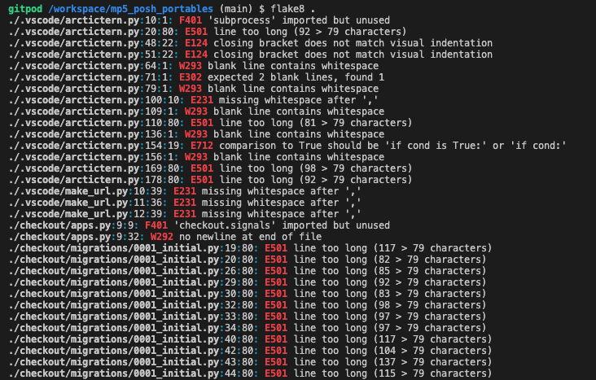
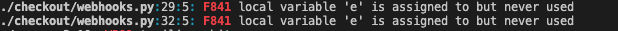
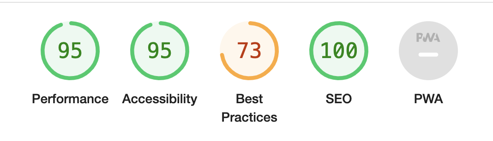
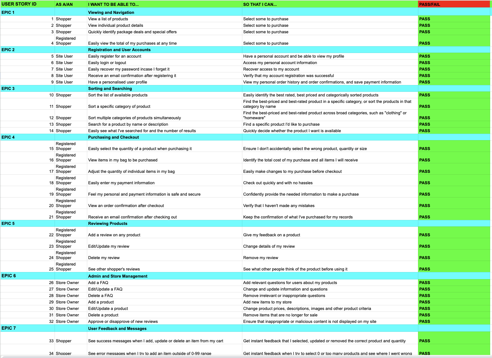

# Posh Portables - E-Commerce Site - Testing

#### **By Lauren Pechey**
[Click here to view the live web application](https://posh-portables-6801c9648247.herokuapp.com/)

This is the testing documentation for my e-commerce web application: Posh Portables.

- - -
## Table of Contents

- [Introduction](#introduction)
- [Automated Testing](#automated-testing-using-test-driven-development)
- [Validation](#validation)
    - [HTML Validation](#html-validation)
    - [CSS Validation](#css-validation)
    - [JavaScript Linting](#javascript-linting)
    - [Python Linting](#python-linting)
    - [Accessibility Testing](#accessibility)
    - [Performance Testing](#performance)
- [Feature Testing](#feature-testing)
    - [Responsiveness/Device Testing](#responsiveness--devices)
    - [Browser Compatibility](#browser-compatibility)
    - [Feature Testing Results](#feature-testing-results)
- [User Stories Testing](#user-stories-testing)
- [Bugs and Fixes](#bugs--fixes)

---

## Introduction

In my testing I developed a comprehensive testing plan to make sure that the site was functioning correctly. I used a combination of automated testing using Django's built in test functionality and manual testing. The site was tested throughout the process, both in the development and deployed version of the sites. All the test results detailed below are based on the [deployed site](https://posh-portables-6801c9648247.herokuapp.com/).

---

## Automated Testing using Test Driven Development

During development I tried to maintain a test driven development approach. This was my first experience of using automated testing on a project so I kept things simple and wrote and ran tests appropriate to my experience level (backed up by rigorous manual testing both during the development process and at the end - see [feature testing](#feature-testing)). This allowed me to build my knowledge within the scope and time restraints of the project and course requirements. As part of the TDD (test driven development) approach; all automated tests were written after the stage of development to make sure that all features were checked for errors.

I found it to be a challenging but useful process, a number of times during development automated tests were able to flag up issues much earlier than I would have noticed them with manual testing alone. With large, complex project with inter-woven features and dependencies I can completely see the benefit of this approach and I look forward to expanding my knowledge and delving more in to the world of automated testing in the future.

### Automated testing coverage and results

A total of 92 tests were run, which tested the models, views and forms of each app in the project. Please see the overall results below. 

Automated Testing Results

In order to carry out automated testing, please comment out the DATABASE URL as follows (see below), as this will prevent the main database from being overridden by accident. 

## Validation

### HTML Validation

I ran the code for all the pages through the [W3C HTML Validator](https://validator.w3.org/nu/) using the textarea input by generating the source code from the deployed site (right click and select 'View Page Source' in Chrome) and pasting it in to allow me to check all pages whether requiring log in or not. All code passed the validation tests. Results below.

HTML Validation Results

#### Issues resolved during validation:

- Image selection in the custom_clearable_file_input on the product form was throwing an error as it had 2 ID attributes, one that I had set which was used in the JavaScript to display the filename and another that was added by the `` tag. I solved this problem by changing the JavaScript to get an element using a class name rather than ID and removing the class.

### CSS Validation

I ran the CSS code through the [W3C CSS Validator](LINK). All code passed the validation tests. Results below.

CSS Validation Results

#### CSS Warnings

There were some warnings thrown up by the CSS Validator.

- Vendor extension warnings: refer to browser specific CSS classes such as `-webkit-transition`. These classes are best practice to make sure that certain CSS elements perform correctly in different browsers and so I have disregarded these warnings.
- Imported style sheets: This refers to Google's font import, again this is a standard way to import fonts directly in to the CSS.
- CSS Variables are not checked: This refers to the :root directory of colours and is just a warning that it cannot check these. They all performed as expected during testing and so I'm happy with this CSS code.

### JavaScript Linting

I ran the JavaScript code through [JSHint](https://jshint.com/). For full results see the dropdown below. Overall, most errors were minor, such as "missing semicolon" or showed warnings related to undefined variables which were named in other files. 

JavaScript Results Table

| **Feature** | **Expected Outcome** | **Test Performed** | **Result** | **Pass / Fail** |
|---|---|---|---|---|
| **quantity_input.js (shopping_cart)** | Page passes validation with no errors | Ran JavaScript through https://jshint.com/ | No Errors | PASS |
| **stripe_elements.js** | Page passes validation with no errors | Ran JavaScript through https://jshint.com/ | Missing semi-colons. All fixed. Undeclared variable (Stripe - declared elsewhere) | PASS |
| **message_toggle.js** | Page passes validation with no errors | Ran JavaScript through https://jshint.com/ | Missing semi-colons. All fixed. No errors remaining | PASS |
| **review_toggle.js** | Page passes validation with no errors | Ran JavaScript through https://jshint.com/ | Missing semi-colons. All fixed. No errors remaining | PASS |
| **quantity_input.js (products)** | Page passes validation with no errors | Ran JavaScript through https://jshint.com/ | No Errors | PASS |
| **countryfield.js** | Page passes validation with no errors | Ran JavaScript through https://jshint.com/ | Unnecessary semi-colon. All fixed. No errors remaining | PASS |
| **rating_select.js** | Page passes validation with no errors | Ran JavaScript through https://jshint.com/ | Missing semi-colons. All fixed. No errors remaining | PASS |
| **scroll_top.js** | Page passes validation with no errors | Ran JavaScript through https://jshint.com/ | Missing semi-colons. All fixed. No errors remaining | PASS |

### Python Linting

I ran the app.py code through [Code Institute's Python Lintor](https://pep8ci.herokuapp.com/) to check the Syntax. GitPod also has a built in Python Linter which was used throughout the development process (see below). All code passed the validation tests. For full results see the dropdowns below.

Python Results Table

Python Results Table

| **App** | **File** | **Expected Outcome** | **Test Performed** | **Result** | **Pass / Fail** |
|---|---|---|---|---|---|
| posh_portables | settings | Code passes with no errors | Ran app.py through https://pep8ci.herokuapp.com/ | Code passes with no errors | PASS |
| posh_portables | urls | Code passes with no errors | Ran app.py through https://pep8ci.herokuapp.com/ | Code passes with no errors | PASS |
| shopping_cart | urls | Code passes with no errors | Ran app.py through https://pep8ci.herokuapp.com/ | Code passes with no errors | PASS |
| shopping_cart | views | Code passes with no errors | Ran app.py through https://pep8ci.herokuapp.com/ | Code passes with no errors | PASS |
| shopping_cart | contexts | Code passes with no errors | Ran app.py through https://pep8ci.herokuapp.com/ | Code passes with no errors | PASS |
| shopping_cart | test_views | Code passes with no errors | Ran app.py through https://pep8ci.herokuapp.com/ | Code passes with no errors | PASS |
| checkout | admin | Code passes with no errors | Ran app.py through https://pep8ci.herokuapp.com/ | Code passes with no errors | PASS |
| checkout | forms | Code passes with no errors | Ran app.py through https://pep8ci.herokuapp.com/ | Code passes with no errors | PASS |
| checkout | models | Code passes with no errors | Ran app.py through https://pep8ci.herokuapp.com/ | Code passes with no errors | PASS |
| checkout | signals | Code passes with no errors | Ran app.py through https://pep8ci.herokuapp.com/ | Code passes with no errors | PASS |
| checkout | urls | Code passes with no errors | Ran app.py through https://pep8ci.herokuapp.com/ | Code passes with no errors | PASS |
| checkout | views | Code passes with no errors | Ran app.py through https://pep8ci.herokuapp.com/ | Code passes with no errors | PASS |
| checkout | webhook_handler | Code passes with no errors | Ran app.py through https://pep8ci.herokuapp.com/ | Code passes with no errors | PASS |
| checkout | webhooks | Code passes with no errors | Ran app.py through https://pep8ci.herokuapp.com/ | Code passes with no errors | PASS |
| checkout | test_forms | Code passes with no errors | Ran app.py through https://pep8ci.herokuapp.com/ | Code passes with no errors | PASS |
| checkout | test_models | Code passes with no errors | Ran app.py through https://pep8ci.herokuapp.com/ | Code passes with no errors | PASS |
| checkout | test_views | Code passes with no errors | Ran app.py through https://pep8ci.herokuapp.com/ | Code passes with no errors | PASS |
| faqs | admin | Code passes with no errors | Ran app.py through https://pep8ci.herokuapp.com/ | Code passes with no errors | PASS |
| faqs | forms | Code passes with no errors | Ran app.py through https://pep8ci.herokuapp.com/ | Code passes with no errors | PASS |
| faqs | models | Code passes with no errors | Ran app.py through https://pep8ci.herokuapp.com/ | Code passes with no errors | PASS |
| faqs | urls | Code passes with no errors | Ran app.py through https://pep8ci.herokuapp.com/ | Code passes with no errors | PASS |
| faqs | views | Code passes with no errors | Ran app.py through https://pep8ci.herokuapp.com/ | Code passes with no errors | PASS |
| faqs | test_forms | Code passes with no errors | Ran app.py through https://pep8ci.herokuapp.com/ | Code passes with no errors | PASS |
| faqs | test_models | Code passes with no errors | Ran app.py through https://pep8ci.herokuapp.com/ | Code passes with no errors | PASS |
| faqs | test_views | Code passes with no errors | Ran app.py through https://pep8ci.herokuapp.com/ | Code passes with no errors | PASS |
| home | urls | Code passes with no errors | Ran app.py through https://pep8ci.herokuapp.com/ | Code passes with no errors | PASS |
| home | views | Code passes with no errors | Ran app.py through https://pep8ci.herokuapp.com/ | Code passes with no errors | PASS |
| home | test_views | Code passes with no errors | Ran app.py through https://pep8ci.herokuapp.com/ | Code passes with no errors | PASS |
| products | admin | Code passes with no errors | Ran app.py through https://pep8ci.herokuapp.com/ | Code passes with no errors | PASS |
| products | forms | Code passes with no errors | Ran app.py through https://pep8ci.herokuapp.com/ | Code passes with no errors | PASS |
| products | models | Code passes with no errors | Ran app.py through https://pep8ci.herokuapp.com/ | Code passes with no errors | PASS |
| products | urls | Code passes with no errors | Ran app.py through https://pep8ci.herokuapp.com/ | Code passes with no errors | PASS |
| products | views | Code passes with no errors | Ran app.py through https://pep8ci.herokuapp.com/ | Code passes with no errors | PASS |
| products | widgets | Code passes with no errors | Ran app.py through https://pep8ci.herokuapp.com/ | Code passes with no errors | PASS |
| products | test_forms | Code passes with no errors | Ran app.py through https://pep8ci.herokuapp.com/ | Code passes with no errors | PASS |
| products | test_models | Code passes with no errors | Ran app.py through https://pep8ci.herokuapp.com/ | Code passes with no errors | PASS |
| products | test_views | Code passes with no errors | Ran app.py through https://pep8ci.herokuapp.com/ | Code passes with no errors | PASS |
| profiles | admin | Code passes with no errors | Ran app.py through https://pep8ci.herokuapp.com/ | Code passes with no errors | PASS |
| profiles | forms | Code passes with no errors | Ran app.py through https://pep8ci.herokuapp.com/ | Code passes with no errors | PASS |
| profiles | models | Code passes with no errors | Ran app.py through https://pep8ci.herokuapp.com/ | Code passes with no errors | PASS |
| profiles | urls | Code passes with no errors | Ran app.py through https://pep8ci.herokuapp.com/ | Code passes with no errors | PASS |
| profiles | views | Code passes with no errors | Ran app.py through https://pep8ci.herokuapp.com/ | Code passes with no errors | PASS |
| profiles | test_forms | Code passes with no errors | Ran app.py through https://pep8ci.herokuapp.com/ | Code passes with no errors | PASS |
| profiles | test_models | Code passes with no errors | Ran app.py through https://pep8ci.herokuapp.com/ | Code passes with no errors | PASS |
| profiles | test_views | Code passes with no errors | Ran app.py through https://pep8ci.herokuapp.com/ | Code passes with no errors | PASS |
| reviews | admin | Code passes with no errors | Ran app.py through https://pep8ci.herokuapp.com/ | Code passes with no errors | PASS |
| reviews | forms | Code passes with no errors | Ran app.py through https://pep8ci.herokuapp.com/ | Code passes with no errors | PASS |
| reviews | models | Code passes with no errors | Ran app.py through https://pep8ci.herokuapp.com/ | Code passes with no errors | PASS |
| reviews | urls | Code passes with no errors | Ran app.py through https://pep8ci.herokuapp.com/ | Code passes with no errors | PASS |
| reviews | views | Code passes with no errors | Ran app.py through https://pep8ci.herokuapp.com/ | Code passes with no errors | PASS |
| reviews | test_forms | Code passes with no errors | Ran app.py through https://pep8ci.herokuapp.com/ | Code passes with no errors | PASS |
| reviews | test_models | Code passes with no errors | Ran app.py through https://pep8ci.herokuapp.com/ | Code passes with no errors | PASS |
| reviews | test_views | Code passes with no errors | Ran app.py through https://pep8ci.herokuapp.com/ | Code passes with no errors | PASS |

#### Additional Linting Using Flake8 in GitPod

I used the inbuilt linting in GitPod (Flake8) to check my code and keep it as clean as possible. All code was cleaned up, errors dealt with and any suggested changes made apart from the following issues which I was unable to solve:

- **checkout/apps.py - checkout.signals is imported but unused** - signals is being passed in and used elsewhere so can be disregarded
- **checkout/webhooks.py - local variable e is assigned to but never used** - have investigated this and it appears to be an industry standard way of assigning this particular error checking. I also passed this same code through the [CI Python Linter](https://pep8ci.herokuapp.com/) and it didn't raise an issue so I am disregarding this.
- Remaining linting errors are in files that are automatically created by Django such as migration files & vscode/arctictern.py
- IMPORTANT: Almost all spacing and long line errors were resolved, and the only exceptions involved lines of code that could not be broken, such as secret keys, or mathematical equations that would have disrupted that funtionality of the website.

Flake8 Results and error screenshots

- - -
[Go to Top](#posh-portables---e-commerce-site---testing)
- - -

### Accessibility

I ran the site through the Chrome Dev Tool's Lighthouse, and scored over 90 for accessibility (see below). I also ran it through [Wave Web Accessibility Evaluation Tool](https://wave.webaim.org/). There were some minor warnings which are detailed in the notes below.

Accessibility Results

The score for best practices was not ideal, but when I checked the issues found, it was to do with the versions of the modules being used for this project. Upgrading the versions was not accessible for the scope of this project, but if this was to be a real e-commerce site, I would have used the latest versions of all modules, including django. 

Best Practices Results

### Performance

I ran the site through Google Chrome Dev Tools' Lighthouse to check on its performance scores. All pages passed the validation tests. For full results see the dropdowns below.

Performance Results Table

| **Feature**                             | **Expected Outcome**                          | **Test Performed**                | **Change / Final Result**               | **Pass / Fail** |
|-----------------------------------------|-----------------------------------------------|-----------------------------------|-----------------------------------------|-----------------|
| **HOME**                                | All scores 90+ with no errors or major issues | Chrome Lighthouse Report for page | Tinified Hero image • All scores 90+    | PASS            |
| **PRODUCTS**                            | All scores 90+ with no errors or major issues | Chrome Lighthouse Report for page | All scores 90+                          | PASS            |
| **PRODUCT DETAILS**                     | All scores 90+ with no errors or major issues | Chrome Lighthouse Report for page | All scores 90+                          | PASS            |
| **CREATE PRODUCT**                      | All scores 90+ with no errors or major issues | Chrome Lighthouse Report for page | All scores 90+                          | PASS            |
| **UPDATE PRODUCT**                      | All scores 90+ with no errors or major issues | Chrome Lighthouse Report for page | All scores 90+                          | PASS            |
| **CREATE REVIEW**                       | All scores 90+ with no errors or major issues | Chrome Lighthouse Report for page | All scores 90+                          | PASS            |
| **UPDATE REVIEW**                       | All scores 90+ with no errors or major issues | Chrome Lighthouse Report for page | All scores 90+                          | PASS            |
| **SHOPPING CART**                       | All scores 90+ with no errors or major issues | Chrome Lighthouse Report for page | All scores 90+                          | PASS            |
| **CHECKOUT**                            | All scores 90+ with no errors or major issues | Chrome Lighthouse Report for page | All scores 90+                          | PASS            |
| **CHECKOUT SUCCESS**                    | All scores 90+ with no errors or major issues | Chrome Lighthouse Report for page | All scores 90+                          | PASS            |
| **PROFILE**                             | All scores 90+ with no errors or major issues | Chrome Lighthouse Report for page | All scores 90+                          | PASS            |
| **FAQS**                                | All scores 90+ with no errors or major issues | Chrome Lighthouse Report for page | All scores 90+                          | PASS            |
| **CREATE FAQ**                          | All scores 90+ with no errors or major issues | Chrome Lighthouse Report for page | All scores 90+                          | PASS            |
| **UPDATE FAQ**                          | All scores 90+ with no errors or major issues | Chrome Lighthouse Report for page | All scores 90+                          | PASS            |
| **SIGN IN (login)**                     | All scores 90+ with no errors or major issues | Chrome Lighthouse Report for page | Added meta description • All scores 90+ | PASS            |
| **REGISTER (signup)**                   | All scores 90+ with no errors or major issues | Chrome Lighthouse Report for page | Added meta description • All scores 90+ | PASS            |
| **MANAGE EMAIL (email)**                | All scores 90+ with no errors or major issues | Chrome Lighthouse Report for page | Added meta description • All scores 90+ | PASS            |
| **CHANGE PASSWORD (password/change)**   | All scores 90+ with no errors or major issues | Chrome Lighthouse Report for page | Added meta description • All scores 90+ | PASS            |
| **FORGOT PASSWORD (password/reset)**    | All scores 90+ with no errors or major issues | Chrome Lighthouse Report for page | Added meta description • All scores 90+ | PASS            |
| **SIGN OUT (logout)**                   | All scores 90+ with no errors or major issues | Chrome Lighthouse Report for page | Added meta description • All scores 90+ | PASS            |
| **VERFICATION SENT (confirm-email)**    | All scores 90+ with no errors or major issues | Chrome Lighthouse Report for page | Added meta description • All scores 90+ | PASS            |
| **CONFIRM EMAIL (confirm-email/(key))** | All scores 90+ with no errors or major issues | Chrome Lighthouse Report for page | Added meta description • All scores 90+ | PASS            |

Performance Results Overall

#### Issues resolved during performance validation:

- Console Error about one of the Favicon icons being missing returning a 404, the site appeared to be looking in the wrong location for the file. I fixed this by explicitly naming all the icons in the `<head>` element and removing the web manifest.

- - -
[Go to Top](#posh-portables---e-commerce-site---testing)
- - -

## Feature Testing

The whole site and all its features were tested manually thoroughly throughout the development process and at the end of development. This testing covered content, style, interactive feature functionality as well as making sure all backend processes worked as expected including testing of all CRUD functionality and routing. This was in addition to the automated testing described [above](#automated-testing-using-test-driven-development). The results of the final full manual test are below.

### **Responsiveness / Devices**

The manual testing was done on the following devices
* Apple Macbook Pro 16inch
* Samsung Galaxy S10
* Apple Mac Pro 13-Inch 
* OnePlus Nord 2023
* Apple iPhone SE 2020
* Apple iPhone SE 2022
* Google Chrome Developer Tools - simulator for all different device options as well as using the adjustable sizing options

### **Browser Compatibility**

The manual testing was done on the following browsers
* Google Chrome
* Mozilla Firefox
* Apple Safari

### **Feature Testing Results**

All Pages

| **Testing**                           | **Expected Outcome**                                                                                                         | **Test Performed**                                                                                                              | **Pass / Fail** |
|---------------------------------------|------------------------------------------------------------------------------------------------------------------------------|-------------------------------------------------------------------------------------------------------------------------|-----------------|
| **Site width**                        | Max width 1400px with grey background                                                                                        | Expand window & use dev tools to check size                                                                                                               | PASS            |
| **Favicon**                           | Appears in browser tab                                                                                                       | Check favicon appears in multiple browsers                                                                                                        | PASS            |
| **Navbar - contents**                 | Contains logo and nav links. All links lead to correct pages.                                                                | Check nav contents. Click on all links.                                                                                                                   | PASS            |
| **Navbar - accounts dropdown**        | Account dropdown is clickable and displays nav links                                                                         | Click on dropdown menu & dropdown links                                                                                                           | PASS            |
| **Navbar - products dropdown**        | Products dropdown displays correct working links                                                                             | Click on products dropdown menu & dropdown links - check products are filtered correctly                                                            | PASS            |
| **Navbar - sticky**                   | Stays at the top of the browser page                                                                                         | Scroll to bottom of page                                                                                                                     | PASS            |
| **Navbar - logo**                     | Clickable and links to homepage                                                                                              | Click on logo                                                                                                                     | PASS            |
| **Navbar - hover**                    | Hover effect with transition                                                                                                 | Hover over nav links                                                                                                                    | PASS            |
| **Navbar - responsive**               | On smaller devices nav links change to a burger menu which displays all links and submenus. Logo changes on smaller screens. | Use dev tools to simulate smaller screen & check on mobile devices. Click on burger menu & all links                                               | PASS            |
| **Navbar - logged out**               | "Visible links on Accounts Dropdown: Register, Sign In"                                                                      | Sign out of site & check nav bar                                                                                                                      | PASS            |
| **Navbar - logged in (non-admin)**    | "Visible links on Accounts Dropdown: My Profile, Sign Out"                                                                   | Sign in to site as non-admin & check nav bar                                                                                                            | PASS            |
| **Navbar - logged in (admin)**        | "Visible links on Accounts Dropdown: Site Management, My Profile, Sign Out"                                                  | Sign in to site as admin & check nav bar                                                                                                                  | PASS            |
| **Navbar - cart (empty)**             | shopping cart icon is yellow with £0 showing if shopping cart is empty                                                                           | Check nav bar with empty shopping cart                                                                                                                      | PASS            |
| **Navbar - shopping cart (contents)**           | shopping cart icon is white with correct total showing                                                                                 | Add products to shopping cart and check nav bar                                                                                                                  | PASS            |
| **Navbar - search box (no contents)** | Search term submits and links to products page. Message appears (no search term)                                             | Click on search icon with no contents in search box                                                                                                   | PASS            |
| **Navbar - search box (contents)**    | Search term submits and links to products page with correct results. Search term appears on page.                            | Add search term to search box and click on search icon. Check results and page contents.                                                               | PASS            |
| **Navbar - search box dropdown**      | On Medium & smaller screens clicking the search icon triggers the dropdown search bar.                                       | "Using dev tools simulate a medium or small screen, click on search icon. Add contents to search bar and click search."                              | PASS            |
| **Delivery Banner**                   | Delivery banner shows correct text and amount                                                                                | Check banner contents                                                                                                                 | PASS            |
| **Footer - contents**                 | "Contains Social links, more info links, about us text, disclaimer & personal links"                                         | Check footer                                                                                                                   | PASS            |
| **Footer - responsive**               | Contents stack on smaller devices & margins adjust                                                                           | Use dev tools to simulate different screen sizes & check on smaller devices                                                                        | PASS            |
| **Footer - Hover on links**           | Hover effect with transition                                                                                                 | Hover over links                                                                                                                    | PASS            |
| **Footer - social**                   | Open correct pages in separate tab                                                                                           | Click on links                                                                                                                    | PASS            |
| **Footer - More Info links**          | Link to correct pages                                                                                                        | Click on links                                                                                                                    | PASS            |

Home

| **Testing**                       | **Expected Outcome**                                                   | **Test Performed**                                                                                      | **Pass / Fail** |
|-----------------------------------|------------------------------------------------------------------------|---------------------------------------------------------------------------------------------------------|-----------------|
| **Page Contents**                 | All page contents appear and are fully responsive                      | Check page contents on different devices and in Chrome Dev Tools                                        | PASS            |
| **Page Links**                    | All page links lead to correct location                                | Click on all links & check page contents                                                                | PASS            |
| **Product Category Filter Links** | All category links lead to products page with correct products visible | Click on category links & categories in product cards & check products page contents.                   | PASS            |
| **Hover effects**                 | Buttons and links have hover effect with smooth transition             | Hover over buttons & links                                                                              | PASS            |
| **Authentication Tests**          | Page is visible to all users                                           | "Navigate to page as an unauthenticated, authenticatied & superuser"                                    | PASS            |
| **Featured Products**             | Only featured products appear                                          | "Go to admin panel, change ‘is_featured’ boolean value on a product, check if product appears on page." | PASS            |

Products

| **Testing**                                | **Expected Outcome**                                                   | **Test Performed**                                                            | **Pass / Fail** |
|--------------------------------------------|------------------------------------------------------------------------|-------------------------------------------------------------------------------|-----------------|
| **Page Contents**                          | All page contents appear and are fully responsive                      | Check page contents on different devices and in Chrome Dev Tools              | PASS            |
| **Page Links**                             | All page links lead to correct location                                | Click on all links & check page contents                                      | PASS            |
| **Authentication Tests**                   | Page is visible to all users                                           | "Navigate to page as an unauthenticated, authenticatied & superuser"          | PASS            |
| **Product Count**                          | Product Count matches number of products                               | Check product count with filtered & unfiltered product selection              | PASS            |
| **Product Category Filters**               | All category links lead to products page with correct products visible | Click on categories in product cards & check product cards and category name. | PASS            |
| **Filtered Products - All Products Reset** | All Products button removes all filters and shows all products         | Filter products by category. Click on ‘All Products’                          | PASS            |
| **Sorting**                                | Sort box sets the correct sort and direction of the product cards      | Select all sorting options and check product cards                            | PASS            |
| **Product Cards**                          | Clicking on card image links to correct product page                   | Click on product card                                                         | PASS            |
| **Product Cards**                          | Product cards contain correct information for products                 | Check card contents against products in database                              | PASS            |

Product Details

| **Testing**                                    | **Expected Outcome**                                                                                | **Test Performed**                                                                                                             | **Pass / Fail** |
|------------------------------------------------|-----------------------------------------------------------------------------------------------------|--------------------------------------------------------------------------------------------------------------------------------|-----------------|
| **Page Contents**                              | All page contents appear and are fully responsive                                                   | Check page contents on different devices and in Chrome Dev Tools                                                               | PASS            |
| **Page Links**                                 | All page links lead to correct location                                                             | Click on all links & check page contents                                                                                       | PASS            |
| **Hover effects**                              | Buttons and links have hover effect with smooth transition                                          | Hover over buttons & links                                                                                                     | PASS            |
| **Product Category Filter Links**              | Category link lead to products page with correct products visible                                   | Click on category link & check products page contents.                                                                         | PASS            |
| **Authentication Tests**                       | Page is visible to all users                                                                        | "Navigate to page as an unauthenticated, authenticatied & superuser"                                                           | PASS            |
| **Authentication Tests - Edit/Delete Product** | Edit / Delete buttons only visible to superusers                                                    | "Navigate to page as an unauthenticated, authenticatied & superuser"                                                           | PASS            |
| **Authentication Tests - Edit Review**         | Edit buttons only visible to creator                                                                | "Navigate to page as an unauthenticated, authenticatied & superuser"                                                           | PASS            |
| **Authentication Tests - Delete Review**       | Delete buttons only visible to creator & superusers                                                 | "Navigate to page as an unauthenticated, authenticatied & superuser"                                                           | PASS            |
| **Non-existent product**                       | 404 page displays if product doesn’t exist                                                          | Navigate to product details for a product id that doesn’t exist on database.                                                   | PASS            |
| **Discontinued product**                       | Error message shows if product is discontinued and user redirected to ‘products’ page               | "Set a product to ‘discontinued’, attempt to navigate to that product using direct URL input."                                 | PASS            |
| **Quantity Input**                             | Quantity Buttons increment/decrement quantity. Quantity can be typed in.                            | Click on quantity buttons. Type in to quantity box.                                                                            | PASS            |
| **Quantity Input**                             | Buttons are disabled when lower/upper limit is reached                                              | Input 1 as quantity & check decrement button. Input 99 as quantity & check increment button                                    | PASS            |
| **Add to shopping cart Button**                          | Adds the correct item and quantity to the shopping cart. Shows a message & shopping cart summary with correct contents. | Input quantity and click on ‘add to shopping cart’. Add another of the same item. Add a different item. Check shopping cart matches at each stage. | PASS            |
| **shopping cart Summary**                                | View shopping cart link leads to shopping cart page & contents match summary.                                           | Click on view shopping cart and compare contents                                                                                         | PASS            |
| **Product Contents**                           | "Product name, description, image & price are correct."                                             | Navigate to page and check product details.                                                                                    | PASS            |
| **Product Image**                              | Clicking on image opens full size image in a new tab.                                               | Navigate to page and click on product image.                                                                                   | PASS            |
| **Product Rating**                             | Product rating is the average of the review ratings.                                                | Compare product rating to ratings on reviews                                                                                   | PASS            |
| **Product Reviews**                            | Reviews are for correct product and sorted by rating (high-low) then date                           | Check random selection of reviews against database entries and check rating/date                                               | PASS            |

Add / Edit / Delete Products

| **Testing**                                               | **Expected Outcome**                                                                                               | **Test Performed**                                                                                                                                                                            | **Pass / Fail** |
|-----------------------------------------------------------|--------------------------------------------------------------------------------------------------------------------|-----------------------------------------------------------------------------------------------------------------------------------------------------------------------------------------------|-----------------|
| **Page Contents**                                         | All page contents appear and are fully responsive                                                                  | Check page contents on different devices and in Chrome Dev Tools                                                                                                                              | PASS            |
| **Page Links**                                            | All page links lead to correct location                                                                            | Click on all links & check page contents                                                                                                                                                      | PASS            |
| **Authentication Tests - Add Product - Logged Out**       | Redirects to login for unauthenticated user with error message & redirects back after sign in.                     | Log out of site. Navigate to add product direct via URL                                                                                                                                       | PASS            |
| **Authentication Tests - Add Product - Non-superuser**    | Redirects to home with error message if user is not superuser                                                      | "Log in as non-superuser, navigate to add product direct via URL"                                                                                                                             | PASS            |
| **Authentication Tests - Add Product - Superuser**        | Opens Add Product Form                                                                                             | "Log in as superuser, navigate to add product page"                                                                                                                                           | PASS            |
| **Add product form**                                      | Has correct fields & all are required (apart from image)                                                           | Navigate to add product form. Attempt to submit form with empty inputs.                                                                                                                       | PASS            |
| **Add product form**                                      | Form can be submitted without an image                                                                             | Submit form without selecting an image                                                                                                                                                        | PASS            |
| **Add product form - submission**                         | "On submission success message displays, product is created in database with correct information"                  | "Submit form, check message and check database (and site if product is not discontinued)"                                                                                                     | PASS            |
| **Authentication Tests - Edit Product - Logged Out**      | Redirects to login for unauthenticated user with error message & redirects back after sign in.                     | Log out of site. Navigate to edit product direct via URL                                                                                                                                      | PASS            |
| **Authentication Tests - Edit Product - Non-superuser**   | Redirects to home with error message if user is not superuser                                                      | "Log in as non-superuser, navigate to edit product direct via URL"                                                                                                                            | PASS            |
| **Authentication Tests - Edit Product - Superuser**       | Opens Edit Product Form                                                                                            | "Log in as superuser, navigate to edit product page"                                                                                                                                          | PASS            |
| **Edit Product Message**                                  | Message displays on page load with product name                                                                    | Click on ‘edit’ on a product and check message contents.                                                                                                                                      | PASS            |
| **Edit Product - Non existent Product**                   | 404 page displays if product doesn’t exist                                                                         | Navigate to edit product for a product id that doesn’t exist on database.                                                                                                                     | PASS            |
| **Edit product form**                                     | Form contains correct information for product                                                                      | Click on edit product and check form contents                                                                                                                                                 | PASS            |
| **Edit product form**                                     | Has correct fields & all are required (apart from image)                                                           | Navigate to add product form. Attempt to submit form with empty inputs.                                                                                                                       | PASS            |
| **Edit product form**                                     | Form can be submitted without an image                                                                             | Remove image if required. Submit form without selecting an image                                                                                                                              | PASS            |
| **Edit product form - submission**                        | "On submission success message displays, product is updated in database with correct information"                  | "Submit form, check message and check database (and site if product is not discontinued)"                                                                                                     | PASS            |
| **Authentication Tests - Delete Product - Logged Out**    | Redirects to login for unauthenticated user with error message & redirects back after sign in.                     | Log out of site. Navigate to delete product direct via URL                                                                                                                                    | PASS            |
| **Authentication Tests - Delete Product - Non-superuser** | Redirects to home page if user is not superuser with error message                                                 | "Log in as non-superuser, navigate to delete product direct via URL."                                                                                                                         | PASS            |
| **Authentication Tests - Delete Product - superuser**     | Superuser is able to delete or discontinue product                                                                 | Sign in to site. Navigate to delete product.                                                                                                                                                  | PASS            |
| **Delete Product - Non existent Product**                 | 404 page displays if product doesn’t exist                                                                         | Navigate to delete product for a product id that doesn’t exist on database.                                                                                                                   | PASS            |
| **Delete Product Modal**                                  | Modal appears when deleting a product to confirm deletion                                                          | Click on delete product                                                                                                                                                                       | PASS            |
| **Delete Product Modal**                                  | Clicking on ‘close’  or cross icon closes the modal and doesn’t delete product                                     | "Click on delete product, click on close button, check product details page still exists, repeat with cross icon."                                                                            | PASS            |
| **Delete Product Modal - non-protected product**          | Clicking on ‘delete’ deletes product from site & displays success message                                          | "Click on delete product, then ‘delete’ in modal. Check message. Check product has gone from site and database."                                                                              | PASS            |
| **Delete Product Modal - protected product**              | Clicking on delete for a product that appears on an previous order brings up modal with option to ‘remove’ product | Attempt to delete a product which appears as a line item on an order. Check modal contents                                                                                                    | PASS            |
| **Delete Product Modal - protected product**              | Clicking ‘remove’ sets the ‘discontinued’ field to True & removes product from site                                | Attempt to delete a product which appears as a line item on an order. Click on remove & check product has gone from site. Check product exists on database with correct ‘discontinued’ value. | PASS            |
| **Products General - Missing Image**                      | Product without an image displays no-image alternative                                                             | Log in as a superused. Add a new product without an image. Check product on all relevant pages.                                                                                               | PASS            |

Shopping cart

| **Testing**                    | **Expected Outcome**                                                                                              | **Test Performed**                                                                          | **Pass / Fail** |
|--------------------------------|-------------------------------------------------------------------------------------------------------------------|---------------------------------------------------------------------------------------------|-----------------|
| **Page Contents**              | All page contents appear and are fully responsive                                                                 | Check page contents on different devices and in Chrome Dev Tools                            | PASS            |
| **Page Links**                 | All page links lead to correct location                                                                           | Click on all links & check page contents                                                    | PASS            |
| **Hover effects**              | Buttons and links have hover effect with smooth transition                                                        | Hover over buttons & links                                                                  | PASS            |
| **Authentication Tests (shopping cart)** | Page is visible to all users                                                                                      | "Navigate to page as an unauthenticated, authenticatied & superuser"                        | PASS            |
| **shopping cart summary message**        | "Appears when adding, removing or updating a product in the shopping cart. Totals match shopping cart contents and exclude delivery." | "Add, remove & update an item in the shopping cart, check message contents."                          | PASS            |
| **shopping cart summary message**        | “Spend £— more” message appears when total is under free delivery threshold in summary.                           | "Add items under £100, check message contents."                                             | PASS            |
| **shopping cart Contents**               | Match items added to shopping cart                                                                                          | "Add items to shopping cart, navigate to shopping cart page & check contents"                                   | PASS            |
| **Product Image Link**         | Clicking on product image leads to the product detail page.                                                       | "Add product to shopping cart, navigate to shopping cart page, click on image."                                 | PASS            |
| **Quantity Input**             | Quantity Buttons increment/decrement quantity for correct product. Quantity can be typed in.                      | Click on quantity buttons. Type in to quantity box. Click on ‘update’.                      | PASS            |
| **Quantity Input**             | Buttons are disabled when lower/upper limit is reached                                                            | Input 1 as quantity & check decrement button. Input 99 as quantity & check increment button | PASS            |
| **Remove Item**                | Removes item from shopping cart & updates shopping cart totals.                                                                       | Click on ‘remove’ for a product. Check shopping cart contents & totals.                               | PASS            |
| **shopping cart totals**                 | shopping cart total matches shopping cart contents. Grand total = shopping cart total + Delivery Charge.                                        | Add contents to shopping cart & check totals add up.                                                  | PASS            |
| **Delivery Charge**            | Is 10% of total for qualifying products                                                                           | Add items to shopping cart which qualify for delivery charge. Check totals.                           | PASS            |
| **Delivery Charge**            | Items which are subject to delivery charge aren’t included in delivery calculations                               | "Add item to shopping cart with no delivery charge, check delivery total."                            | PASS            |
| **Free delivery threshold**    | “Spend £— more” message appears when total is under free delivery threshold on shopping cart page.                          | "Add items under £100 and navigate to the shopping cart page, check message & contents."              | PASS            |
| **Checkout Link**              | Checkout button links to checkout page and order summary matches shopping cart contents.                                    | "Add items to shopping cart, navigate to shopping cart page, click on ‘checkout’"                               | PASS            |

Add / Edit / Delete Reviews

| **Testing**                                            | **Expected Outcome**                                                                           | **Test Performed**                                                                                                                                              | **Pass / Fail** |
|--------------------------------------------------------|------------------------------------------------------------------------------------------------|-----------------------------------------------------------------------------------------------------------------------------------------------------------------|-----------------|
| **Page Contents**                                      | All page contents appear and are fully responsive                                              | Check page contents on different devices and in Chrome Dev Tools                                                                                                | PASS            |
| **Page Links**                                         | All page links lead to correct location                                                        | Click on all links & check page contents                                                                                                                        | PASS            |
| **Authentication Tests - Add Review**                  | Redirects to login for unauthenticated user & redirects back after sign in                     | Navigate to page as an unauthenticated user and click on add review then log in.                                                                                | PASS            |
| **Add Review form**                                    | Product name & image match expected product                                                    | Navigate to ‘add review’ from product details page. Check form header.                                                                                          | PASS            |
| **Add Review form**                                    | Title and contents inputs are required                                                         | Check form for ‘*’ symbol. Attempt to submit form with empty inputs.                                                                                            | PASS            |
| **Add Review - Non existent Product**                  | 404 page displays if product doesn’t exist                                                     | Navigate to add review for a product id that doesn’t exist on database.                                                                                         | PASS            |
| **Add Review form - rating**                           | Clicking on rating hexes changes colour correctly                                              | "Click on hexes, check colour changes with multiple selections."                                                                                                | PASS            |
| **Add Review form - submission**                       | Submitted review only visible on profile page until approved.                                  | Submit form and check review doesn’t appear on product details page. Check product rating hasn’t updated. Go to profile page & check review has ‘pending’ flag. | PASS            |
| **Add Review form - submission**                       | Success message displays. Review contents match form submission                                | "Submit form, check message, navigate to profile page, check review contents."                                                                                  | PASS            |
| **Authentication Tests - Edit Review - Logged Out**    | Redirects to login for unauthenticated user with error message & redirects back after sign in. | Log out of site. Navigate to edit_review direct via URL                                                                                                         | PASS            |
| **Authentication Tests - Edit Review - Non-creator**   | Redirects to product details page if user is not creator with error message                    | "Log in as superuser & non-superuser, navigate to edit_review direct via URL for a review created by a different user."                                         | PASS            |
| **Authentication Tests - Edit Review - creator**       | User is able to access edit form for own review                                                | Sign in to site. Navigate to edit_review for a review created by current user.                                                                                  | PASS            |
| **Edit Review - Non existent Review**                  | 404 page displays if review doesn’t exist                                                      | Navigate to edit review for a review id that doesn’t exist on database.                                                                                         | PASS            |
| **Edit Review Message**                                | Message displays on page load with review title                                                | Click on ‘edit’ on a review and check message contents.                                                                                                         | PASS            |
| **Edit Review Form**                                   | Form contains correct contents                                                                 | Click on edit review and check form contents                                                                                                                    | PASS            |
| **Edit Review Form**                                   | All form inputs are required                                                                   | Attempt to submit form with empty inputs.                                                                                                                       | PASS            |
| **Edit Review Form - Submission**                      | Submitted review only visible on profile page until approved.                                  | Submit form and check review doesn’t appear on product details page. Check product rating has updated. Go to profile page & check review has ‘pending’ flag.    | PASS            |
| **Edit Review form - submission**                      | Success message displays. Review contents match form submission                                | "Submit form, navigate to profile page, check review contents."                                                                                                 | PASS            |
| **Edit Review form - post submission**                 | After submission the user is returned to the page where they clicked EDIT                      | "Click on edit review from the profile page, product page & admin page, submit form and check where redirected to."                                             | PASS            |
| **Authentication Tests - Delete Review - Logged Out**  | Redirects to login for unauthenticated user with error message & redirects back after sign in. | Log out of site. Navigate to delete_review direct via URL                                                                                                       | PASS            |
| **Authentication Tests - Delete Review - Non-creator** | Redirects to product details page if user is not creator with error message                    | "Log in as superuser & non-superuser, navigate to delete_review direct via URL for a review created by a different user."                                       | PASS            |
| **Authentication Tests - Delete Review - creator**     | User is able to access edit form for own review                                                | Sign in to site. Navigate to delete_review for a review created by current user.                                                                                | PASS            |
| **Delete Review - Non existent Review**                | 404 page displays if review doesn’t exist                                                      | Navigate to delete review for a review id that doesn’t exist on database.                                                                                       | PASS            |
| **Delete Review Modal**                                | Modal appears when deleting a review to confirm deletion                                       | Click on delete review                                                                                                                                          | PASS            |
| **Delete Review Modal**                                | Clicking on ‘close’  or cross icon closes the modal and doesn’t delete review                  | "Click on delete review, click on close button, check review is still on page, repeat with cross icon."                                                         | PASS            |
| **Delete Review Modal**                                | Clicking on ‘delete’ deletes review from site & displays success message                       | "Click on delete review, click on delete button, check message, check review is no longer on page. Check product rating has updated accordingly."               | PASS            |
| **Delete Review form - post submission**               | After submission the user is returned to the page where they clicked DELETE                    | "Click on edit review from the profile page, product page & admin page, submit form and check where redirected to."                                             | PASS            |

FAQs

| **Testing**                           | **Expected Outcome**                                                                                                     | **Test Performed**                                                                                        | **Pass / Fail** |
|---------------------------------------|--------------------------------------------------------------------------------------------------------------------------|-----------------------------------------------------------------------------------------------------------|-----------------|
| **Page Contents**                     | All page contents appear and are fully responsive                                                                        | Check page contents on different devices and in Chrome Dev Tools                                          | PASS            |
| **Page Links**                        | All page links lead to correct location                                                                                  | Click on all links & check page contents                                                                  | PASS            |
| **Hover effects**                     | Buttons and links have hover effect with smooth transition                                                               | Hover over buttons & links                                                                                | PASS            |
| **Authentication Tests**              | Page is visible to all users                                                                                             | "Navigate to page as an unauthenticated, authenticatied & superuser"                                      | PASS            |
| **Authentication Tests**              | "Add FAQ button, edit/delete buttons only visible to superuser"                                                          | Navigate to page as an unauthenticated & superuser                                                        | PASS            |
| **FAQ Content**                       | All FAQs on database appear on site                                                                                      | Compare FAQ content to database                                                                           | PASS            |
| **FAQ concertina**                    | "Clicking on a question reveals the answer and hides the other answers, clicking again hides that answer"                | Click on questions                                                                                        | PASS            |
| **Authentication Tests - Add FAQ**    | Page is only accessible to logged in superuser. Logged out users will be redirected to login page then returned to page. | Attempt to navigate to page as an unauthenticated user. Attempt to navigate to page as a logged out user. | PASS            |
| **Add FAQ Form**                      | Both inputs are required                                                                                                 | Check ‘*’ appears on inputs. Attempt to submit form with empty inputs.                                    | PASS            |
| **Add FAQ Submission**                | Adds new FAQ to database and FAQ page. Success message shows                                                             | "Fill in form & submit, check database and FAQs page."                                                    | PASS            |
| **Authentication Tests - Edit FAQ**   | Page is only accessible to logged in superuser. Logged out users will be redirected to login page then returned to page. | Attempt to navigate to page as an unauthenticated user. Attempt to navigate to page as a logged out user. | PASS            |
| **Edit FAQ - Non existent FAQ**       | 404 page displays if FAQ id doesn’t exist                                                                                | Navigate to faqs/edit/999 (non-existent id).                                                              | PASS            |
| **Edit FAQ Form**                     | Both inputs are required                                                                                                 | Check ‘*’ appears on inputs. Attempt to submit form with empty inputs.                                    | PASS            |
| **Message on page load**              | Navigating to edit FAQ form shows info message with FAQ question                                                         | Navigate to form and check message                                                                        | PASS            |
| **Edit FAQ Submission**               | Edits FAQ on database and FAQ page. Success message shows                                                                | "Update form & submit, check message, check database and FAQs page."                                      | PASS            |
| **Authentication Tests - Delete FAQ** | View is only accessible to logged in superuser. Logged out users will be redirected to login page then returned to view. | Attempt to navigate to page as an unauthenticated user. Attempt to navigate to page as a logged out user. | PASS            |
| **Delete FAQ - Non existent FAQ**     | 404 page displays if FAQ id doesn’t exist                                                                                | Navigate to faqs/delete/999 (non-existent id).                                                            | PASS            |
| **Delete FAQ Modal**                  | Modal appears when deleting an FAQ to confirm deletion                                                                   | Click on delete FAQ                                                                                       | PASS            |
| **Delete FAQ Modal**                  | Clicking on ‘close’  or cross icon closes the modal and doesn’t delete FAQ                                               | "Click on delete FAQ, click on close button, check FAQ is still on page, repeat with cross icon."         | PASS            |
| **Delete FAQ Modal**                  | Clicking on ‘delete’ deletes FAQ from site & displays success message                                                    | "Click on delete FAQ, click on delete button, check message, check FAQ is no longer on page & database."  | PASS            |

Error Pages

| **Testing**       | **Expected Outcome**                                                  | **Test Performed**                                                                                                                                                                                         | **Pass / Fail** |
|-------------------|-----------------------------------------------------------------------|------------------------------------------------------------------------------------------------------------------------------------------------------------------------------------------------------------|-----------------|
| **Page Contents** | All page contents appear and are fully responsive                     | Check page contents on different devices and in Chrome Dev Tools                                                                                                                                           | PASS            |
| **Page Links**    | All page links lead to correct location                               | Click on all links & check page contents                                                                                                                                                                   | PASS            |
| **404 Page**      | Test custom 404 page is loaded when navigating to a non-existent page | Navigate to URL that doesn’t exist on site.                                                                                                                                                                | PASS            |

## User Stories Testing

The site was built from the outset with user stories at its core. The site was tested against each of the user stories, running through the steps a user would take to achieve their goal. The results can be found below.

User Stories Testing Table

- - -
[Go to Top](#posh-portables---e-commerce-site---testing)
- - -

## Bugs & Fixes

I encountered the following significant or interesting bugs during development. All of these were fixed and I am unaware of any remaining bugs on the site.

#### Bug 1 - Products page wouldn't load after deployment

**Issue:** After initial deployment my products page wouldn't load and returned a 400 error.

**Fix:** I turned debug back on in the deployed site and discovered that it couldn't load the sort_box.js file and was throwing up a suspicious operation error and blocking the page. I fixed this error with the help of this [Slackoverflow Post](https://stackoverflow.com/questions/43529912/suspicious-operation-attempted-access-to-denied-while-loading-static-files) by removing the leading '/' on the script tag in the template.

#### Bug 2 - Checkout creating duplicate orders

**Issue:** Whilst initially working correctly I found that my checkout began to create duplicates when placing an order - one in the view and another in the webhook.

**Fix:** After extensive research and testing using print statements I discovered that the problem was at the point where the webhook searches for the order in the database and if it didn't find it, creates the order. The problem stemmed from the form fields which were not required and so could be empty - phone number and street address 2. I fixed the problem by removing these fields from the search parameters in the webhook query.

#### Bug 3 - Broken Image Links show icon rather than backup no-image

**Issue:** Broken image links showing when image is missing, rather than the 'no-image' backup which provides a better user experience. This also meant that if there was an error getting the product image the product cards were hard to click on to link to the product detail page as the image is the link element.

**Fix:** I added an 'onerror' to the image tags to show the no-image if there was an error displaying the image.

#### Bug 4 - Toast showing shopping cart summary after user actions not related to shopping cart

**Issue:** This was more of a user experience issue than a bug. I had followed the Boutique Ado walkthrough for the Toasts & user feedback messages and whilst the little shopping cart summary was a great touch it was showing after every successful user action apart from on the profile page where there was code to stop this happening. I needed to find a more comprehensive way to hide the summary when users added reviews, FAQs, filled in the Contact Us form etc.

**Fix:** I removed it by firstly adding an additional conditional statement to the toast_success template to check whether the referring page url contained the word 'accounts' to stop the cart showing when any toasts.success were called by the built-in allauth code. Then in addition, I added a session variable called show_cart_summary to true or false each time I called messages.success and an additional conditional value in the template tag to check this value.

- - -
[Go to Top](#posh-portables---e-commerce-site---testing)
- - -

